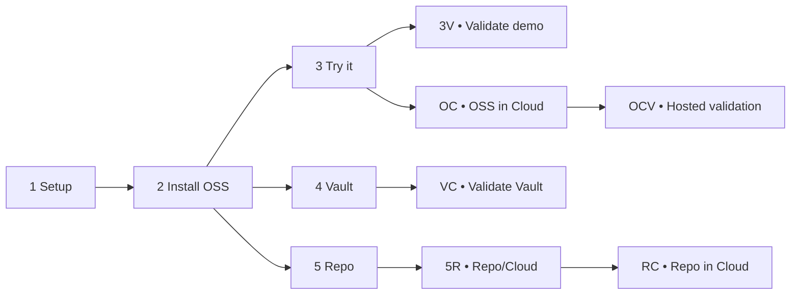
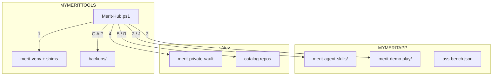

# Merit-Hub — one file

**Download one script:** [`Merit-Hub.ps1`](Merit-Hub.ps1) — standalone, no git, no folder, no `.json`, no extra launcher.

`%MYMERITTOOLS%` (e.g. `C:\Tools` or `C:\DevTools`) is a **laptop folder**, not a git repo. Menu **1** installs `merit-venv` and shims on the machine; do not copy your Tools tree back into this repo.

**Current release:** **MERIT Skills `0.5.181`**. The matching Git tag is `skills-v0.5.181`; menu **K** is the advanced rollback selector.

**Raw download:** `https://raw.githubusercontent.com/AgentDraven/merit-agent-skills/main/Merit-Hub/Merit-Hub.ps1`

**Output:** normal runs are concise and show three ready-to-use sequences: `START` for a new laptop, `PROVE` for local-to-cloud validation, and `CLEAN` for safe cleanup: `G` scan → `A` archive → `P` pristine (`S` is the non-destructive soft-cleanup alternative). Add `-Verbose` (or `-v`) to show the full journey map, paths, environment scopes, drill-ins, and diagnostic details.

**Cleanup safety:** Pristine never treats the Hub, `MYMERITTOOLS`, or portable `pwsh` as an app bench. If an old `MYMERITAPP` value points there, Hub refuses it, removes nothing from that path, explains why, and tells you to use **M** to select a separate app folder. Cleanup helpers time out rather than waiting forever on a locked path.

---

## Quick index 🧭

- [⭐ Recommended first journey](#recommended-first-journey)
- [Choose your adventure](../README.md#which-adventure-fits-you-)
- [Beginner command map](#beginner-command-map-)
- [After each path: acceptance](#after-each-path-quick-acceptance-)
- [Persona pathways](#if-you-want-to-personas)
- [Advanced options](#advanced-options)
- [Cold-start details](#cold-start-sequence)

## Recommended first journey ⭐

For a new user, follow this evidence-gated path:

```text
1 Setup → 2 Install OSS → 3 Try it → 3V Validate → OC OSS in Cloud → OCV hosted walkthrough → 6 Join
```

Each step can be repeated. Hub pauses safely on errors, explains what failed,
and returns to the menu; `0` (zero) is the only exit.

---

## Beginner command map 🎮

Choose one row and follow it left-to-right. Subcommands are indented so the
letter `O` cannot be confused with zero `0` (Stop).



| Command | What it does | When to use it |
|---|---|---|
| `1` | Sets laptop folders and prerequisites | First run or path repair |
| `2` | Installs pinned `merit-agent-skills` | After `1` |
| `3` | Refreshes demo, starts/reuses HTTP port 3000, opens `/play/` | Try the local consumer |
| `OC` | Preflights and publishes the OSS demo to merit-prod | After `3` passes |
| `3V` | Walks through browser, verify, and E2E checks | Repeatable validation |
| `OCV` | Walks through the published OC play, register, and marketing URLs | After `OC` succeeds |
| `4` / `VC` | Clones vault / validates Venture-Capable status | Operator path |
| `5` / `5R` / `RC` | Clones and validates a catalog repo/cloud host | Catalog path |
| `6` | Opens MERIT registration/join routes | After `OC` or `4` |
| `0` | Stops Hub | Only exit command |

## Advanced options 🛠️

Advanced helpers: `I` install IDE skills, `M` change `MYMERITAPP`, `T` change
`MYMERITTOOLS`, `W` show surfaces, `K` list/select approved CompatSets, and
`G/A/P/S` provide sprawl and cleanup modes.

## Three-step pathway cards 🧩

> **Pin warning?** If Surface prints `Hub skills-vX != B VERSION Y`, the local OSS bench is not the payload the Hub expects. Hub actions may be out of sync. Choose **2 Install OSS** to restore the default pin, or use **K** to select an approved CompatSet; do not ignore the warning for a release test.

Every pathway follows the same rhythm: **Start → Make progress → Finish**.

### Try MERIT / local demo 🚀

1. **Start**
   - Download and run `Merit-Hub.ps1`.
   - Choose `1` to set laptop paths and prerequisites.
   - Choose `2` to install the pinned OSS skills.
2. **Make progress**
   - Choose `3`; Hub refreshes `merit-demo` and serves HTTP on port 3000.
   - Open `/play/` and confirm Hosted Ready plus the mounted workbench.
   - Run `3V` to repeat browser, verify, and E2E checks.
3. **Finish**
   - Confirm Register free opens the hosted route.
   - Confirm the local marketing portal opens over HTTP.
   - Keep the receipt/evidence before moving to `OC`.

### Publish OSS in Cloud / OC ☁️

1. **Start**
   - Complete the local `3V` checks.
   - Confirm `play/`, `portal/`, and `cfg/par_pins.json` exist.
   - Choose `OC`; Hub begins the OC preflight.
2. **Make progress**
   - Preflight checks pins, SRI, artifacts, merit-prod health, and portal readiness.
   - Hub publishes the play/config and activates the store route.
   - Hub prints the hosted play, register, and marketing URLs.
3. **Finish**
   - Run `OCV` to open each hosted URL one at a time.
   - Confirm Hosted Ready, registration, and marketing content.
   - Save the OC receipt; fix and retry if any gate fails.

### Vault / VC 🔐

1. **Start**
   - Complete `1` and `2` on the operator laptop.
   - Choose `4` to clone the private vault.
   - Confirm the private remote and operator identity.
2. **Make progress**
   - Choose `VC` to run vault/operator readiness checks.
   - Validate runtime gates and private configuration.
   - Keep vault files private and local/git-backed.
3. **Finish**
   - Confirm operator runtime verification passes.
   - Record the vault evidence and access state.
   - Use `6` only when the operator journey is ready.

### Catalog repo / 5R → RC 📦

1. **Start**
   - Complete `1` and `2`.
   - Choose `5` and identify the consumer/provider role.
   - Confirm the selected repository and remote.
2. **Make progress**
   - Use `5R` for local repository and cloud-status checks.
   - Run the repository’s own verify/build checks.
   - Confirm its production host and deployment identity.
3. **Finish**
   - Choose `RC` to validate the repository in its cloud host.
   - Record URLs, version, and health evidence.
   - Keep this path separate from the shared OC demo.

## After each path: quick acceptance ✅

**After `3` / `3V` (local demo):**

- `/play/` opens over HTTP and reports Hosted Ready.
- The workbench is mounted and `Register free` opens the hosted route.
- `/portal/` opens locally; no `C:\` file path is treated as hosting proof.
- `3V` checks can be repeated in any order. See the [consumer checklist](../merit-demo%20docs/IAR/MERIT_DEMO_TDD_CHECKLIST.md).

**After `OC` (OSS in the Cloud):**

- OC preflight passes local routes, pins/SRI, artifact reachability, merit-prod health, and portal readiness.
- Hosted play, registration/store activation, and marketing portal URLs are printed and recorded.
- A failed preflight blocks publication; fix the named item and retry `OC`.
- Run `OCV` afterward to open and review each hosted URL step-by-step.

**After `4` / `VC` (Vault):**

- Vault remains a private working clone; it is never published as the public OC runtime.
- `VC` confirms operator/tenant readiness and points to the vault runtime checks.

**After `5` / `5R` / `RC` (catalog repo):**

- The selected repo is cloned locally, its role is recorded, and its own production host is validated.
- `RC` is separate from OC: it validates that repo's cloud deployment, not merit-prod's shared demo.

**After `6` (Join):** confirm the registration page opens, then record the resulting URL in the applicable receipt.

For full evidence, use the linked consumer TDD checklist and the skills [IAR index](../docs/IAR/README.md). Hub never claims a branch is complete from a menu banner alone.

> **When should I move from OSS to Vault?** Start in OSS while learning, building,
> and using the public hosted rails. Move to **Vault / VC** when you need private
> operator controls, tenant-grade runtime gates, private configuration, or
> production ownership. Your public OC app can remain on merit-prod; Vault is the
> protected operator lane, not a required upgrade for beginners.

---

## If you want to… (personas)

| If you want to… | Then |
|-----------------|------|
| **Cold-start MERIT on a new laptop** | Download Raw `Merit-Hub.ps1` → `C:\Tools\` (any folder; `MYMERITTOOLS` need not exist yet) → run full `-File` line → **1** → **2** (skills) → **3** (demo) |
| **Publish a creator app in the cloud (no vault)** | After **2** → **OC** → **6** Join |
| **Work as vault operator (AgentDraven / partner)** | After **2** → **4** → **VC** → `runtime out` + `runtime verify` → **6** |
| **Clone and deploy a catalog repo (m4fi, …)** | After **2** → **5** → **RC** |
| **Install MERIT skills into Cursor / Codex / etc.** | After **2** → **I** (or `-InstallSkills Cursor`) |
| **See what is on this laptop (A+B+C+D+H)** | **W** or `-Surface` |
| **Preview leftover MERIT folders before cleanup** | **G** or `-SprawlScan` (no changes) |
| **Archive laptop state without wiping** | **A** or `-PrePristine` |
| **Full reset and walk cold-start again** | Fresh Raw Hub → **G** (optional) → **A** → **P** → **1** → **2** → **3** |
| **Wipe bench only; keep `~/dev` clones** | **S** or `-Soft` |
| **Change where OSS bench or tools live** | **M** (`MYMERITAPP`) or **T** (`MYMERITTOOLS`) |
| **Second creator on same PC** | Separate `MYMERITAPP` bench + [`oc-bench.ps1`](oc-bench.ps1) or Hub **OC -NewOc** |

---

## Recommended sequences

### New laptop (first time)

```text
Download Hub to C:\Tools (MYMERITTOOLS need not exist yet)
→ cd C:\Tools
→ pwsh -NoProfile -ExecutionPolicy Bypass -File .\Merit-Hub.ps1
→ 1 Setup → 2 Install OSS (skills pin) → 3 Try it (public merit-demo) → (OC | 4 | 5) → 6 Join
→ type 0 at Select when done (Hub stays open until 0)
```

### Messy laptop (sprawl from testing MYMERIT* names)

```text
Fresh Raw Hub → G (sprawl preview) → A (archive + sprawl review) → P (wipe) → 1 → 2 → 3 → W
```

### Operator validation laptop

```text
A → -Help (confirm pin) → P → 1 → 2 → I → 4 → VC → runtime out/verify
```

### Cleanup-only (no full wipe)

```text
G → A    (or S for bench-only soft cleanup)
```

---

## How the pieces fit together



**Law:** Hub owns **cold start on one laptop**. Vault owns **policy + CompatSet**. Skills repo owns **OSS catalog + public docs**.

---

## Cold-start sequence

<a id="cold-start-sequence"></a>

1. Open [`Merit-Hub.ps1`](Merit-Hub.ps1) on GitHub → **Raw** → Save As `C:\Tools\Merit-Hub.ps1` (browser **Keep**). `%MYMERITTOOLS%` need not exist yet; menu **1** persists it.
2. From that folder, run this entire line (do **not** double-click):

```powershell
cd C:\Tools
pwsh -NoProfile -ExecutionPolicy Bypass -File .\Merit-Hub.ps1
```

3. First run: **Enter** for `MYMERITTOOLS` / `MYMERITAPP` defaults (or pick your own paths).
4. **1** Setup laptop — git / gh / pwsh + Python (**V**env under tools, **G**lobal shim, or **S**kip).
5. **2** (alias **J**) Install OSS — clone skills pin only (no merit-demo).
6. **3** Try it — clone public [`Mr-PI-Bala/merit-demo`](https://github.com/Mr-PI-Bala/merit-demo) (no GitHub login) and open `play\index.html`.
7. Branch: **OC** · **4** (vault) · **5** (catalog).
8. **6** Join MERIT — after **OC** or after **4**.
9. Type **0** at **Select** when done. Hub stays open after steps; do not rely on closing the window.

---

## Full menu reference

Do **1** then **2** then **3** first unless you are only running cleanup keys (**G A P S**).

### Numbered keys (cold start)

| Key | CLI flags | Action |
|-----|-----------|--------|
| **1** | `-Prereqs` | Setup laptop — git, gh, pwsh, persist `MYMERIT*`, Python (**V**env / **G**lobal shim / **S**kip) |
| **2** | `-Jumpstart Oss`, `-InstallOss`, `-OssPhase`, **J** | Install OSS — skills pin only (no merit-demo) |
| **3** | `-TryIt` | Clone public `Mr-PI-Bala/merit-demo` + open `play\index.html` |
| **OC** | `-Oc`, `-NewOc` | OSS in the Cloud — DualRail play + store activate |
| **OCV** | Hub menu `OCV` | Hosted OC tutorial — review published URLs and evidence |
| **4** | `-Jumpstart Vault` | Clone private vault (local working copy) |
| **VC** | `-Vc` | Venture Capable — operator BootStrap + gates (after **4**) |
| **5** | `-R` | Catalog clone — consumer or provider role |
| **RC** | `-Rc` | Deploy **that** catalog repo to its host (Vercel) — not OC |
| **6** | `-JoinMerit` | Portal / register links — after **OC** or **4** |
| **0** | — | Stop |

### Cleanup keys (ALSO)

| Key | CLI flags | Archive? | Wipe? | When to use |
|-----|-----------|----------|-------|-------------|
| **G** | `-SprawlScan`, `-VestigialScan` | No | No | Preview leftover MERIT roots, duplicate skills clones, stale Hub copies |
| **A** | `-PrePristine`, `-BackupOnly`, **B** | Yes | No | Save env + Hub + oss-bench + sprawl archive; refresh Tools Hub |
| **P** | `-Pristine`, `-Force` | Yes | Full | Cold-start reset; keeps canonical Tools Hub + `backups\` |
| **S** | `-Soft` | Yes | Bench only | Clear bench/status; keep `~/dev` clones |

**Sprawl review flow (built into A and P):** Hub lists vestigial paths → prompt `[y/N/review]` → moves accepted items to `backups\<stamp>\vestigial-archived\` → writes `vestigial-scan.json`. Protected: `Setup_LocalModels*`, `backups\`, canonical `MYMERIT*` trees.

### Utility keys

| Key | CLI flags | Action |
|-----|-----------|--------|
| **I** | `-InstallSkills <host>` | Copy `skills/` to Cursor, Codex, Hermes, … (after **2**) |
| **M** | — | Set `MYMERITAPP` bench path |
| **T** | — | Set `MYMERITTOOLS` root |
| **W** | `-Surface` | Where / Surface — A+B+C+D+H diagnostic map |
| **H** | `-Help` | Reprint menu |

---

## CLI reference (non-interactive)

```powershell
# Cold start
pwsh -NoProfile -ExecutionPolicy Bypass -File $env:MYMERITTOOLS\Merit-Hub.ps1 -Prereqs
pwsh -NoProfile -ExecutionPolicy Bypass -File $env:MYMERITTOOLS\Merit-Hub.ps1 -InstallOss
pwsh -NoProfile -ExecutionPolicy Bypass -File $env:MYMERITTOOLS\Merit-Hub.ps1 -TryIt

# Cleanup
pwsh -NoProfile -ExecutionPolicy Bypass -File $env:MYMERITTOOLS\Merit-Hub.ps1 -SprawlScan
pwsh -NoProfile -ExecutionPolicy Bypass -File $env:MYMERITTOOLS\Merit-Hub.ps1 -PrePristine
pwsh -NoProfile -ExecutionPolicy Bypass -File $env:MYMERITTOOLS\Merit-Hub.ps1 -Pristine
pwsh -NoProfile -ExecutionPolicy Bypass -File $env:MYMERITTOOLS\Merit-Hub.ps1 -Soft

# Branch paths
pwsh -NoProfile -ExecutionPolicy Bypass -File $env:MYMERITTOOLS\Merit-Hub.ps1 -Oc
pwsh -NoProfile -ExecutionPolicy Bypass -File $env:MYMERITTOOLS\Merit-Hub.ps1 -Jumpstart Vault
pwsh -NoProfile -ExecutionPolicy Bypass -File $env:MYMERITTOOLS\Merit-Hub.ps1 -Vc
pwsh -NoProfile -ExecutionPolicy Bypass -File $env:MYMERITTOOLS\Merit-Hub.ps1 -R -Role consumer
pwsh -NoProfile -ExecutionPolicy Bypass -File $env:MYMERITTOOLS\Merit-Hub.ps1 -InstallSkills Cursor
pwsh -NoProfile -ExecutionPolicy Bypass -File $env:MYMERITTOOLS\Merit-Hub.ps1 -Surface
```

---

## Branch paths

| Path | Keys | Hosted? | Who |
|------|------|---------|-----|
| **Creator OC** | 2 → OC → 6 | Yes — merit-prod DualRail | Public creator |
| **Operator VC** | 2 → 4 → VC → 6 | No — vault stays private git | AgentDraven / partner |
| **Catalog** | 2 → 5 → RC | Yes — that repo's Vercel host | Consumer or provider |

---

## Pristine restart (from zero)

1. **Fresh Hub (mandatory)** — download Raw and overwrite `%MYMERITTOOLS%\Merit-Hub.ps1`. Confirm `-Help` shows current pin.
2. **G** (optional) — sprawl preview only.
3. **A** — archive + sprawl review; no wipe.
4. **P** — same archive pack, then full wipe (type `PRISTINE`).
5. **1 → 2 → 3** — cold start.
6. **W** — verify surface; `merit.ps1 where` + `merit.ps1 law closeout` from bench clone.
7. **I** (optional) — refresh IDE skill folders.

Hub **P** does not delete `%USERPROFILE%\.cursor\` wholesale; use **I** for skill refresh.

---

## CompatSet & pins

### What Hub reports

Hub highlights synchronization decisions in magenta: skills are checked out at
the exact embedded `skills-v*` pin, while `merit-demo` is fast-forward refreshed
from `origin/main`. Local changes or divergent history stop safely; nothing is
overwritten. Use menu **K** to list supported skills tags for advanced review.

For everyday use, there is one number: **MERIT Skills `0.5.180`**. Hub **2** installs that release by default. Its Git tag is named `skills-v0.5.180`; that is the same release written in Git's tag style, not a second version.

Menu **K** is the advanced exception: it lists the current release plus two approved rollback releases. A selected rollback is shown only while it is active. Vault and portable-PowerShell pins are implementation details; they appear only inside their respective advanced operations.

---

## Required: run the full command

```powershell
pwsh -NoProfile -ExecutionPolicy Bypass -File $env:MYMERITTOOLS\Merit-Hub.ps1
```

Windows treats internet downloads as unsigned scripts. `-ExecutionPolicy Bypass` is for **this process only**. Browser **Keep** when prompted.

---

## PowerShell 7 (pwsh)

Merit-Hub prefers **PowerShell 7+**, but a fresh device does not need pwsh preinstalled.

- Windows PowerShell 5.1 can parse the standalone Hub, explain the requirement, ask for confirmation, install a laptop-local portable `pwsh` under `%MYMERITTOOLS%\pwsh\`, and relaunch the Hub.
- `Merit-Hub.sh` is the Linux/macOS launcher. If `pwsh` is missing it asks for confirmation, downloads the pinned portable PowerShell release under `$MYMERITTOOLS/pwsh`, and relaunches the same `Merit-Hub.ps1`.
- Set `MERIT_HUB_AUTO_INSTALL_PWSH=1` only when unattended bootstrap is explicitly intended. A declined install exits with a clear remediation command.
- The standalone PowerShell source is ASCII-safe so Windows PowerShell 5.1 does not misparse UTF-8 punctuation from a browser download.

Windows direct invocation remains:

```powershell
.\Merit-Hub.ps1
```

POSIX invocation is:

```bash
./Merit-Hub.sh
```

## Repository ownership recovery

Hub does not run the normal clone/install workflow elevated. Elevation is reserved for destructive cleanup modes. This keeps Git clones owned by the interactive user instead of `BUILTIN\\Administrators`.

If an older Hub run or an externally elevated clone left a repository unwritable, inspect and repair the exact worktree through the public CLI:

```powershell
.\merit.ps1 admin ownership status --path <repo>

Hook enforcement status is recorded in `.merit-hook-install.json`; unsupported hosts receive `.merit-hook-warning.json`. See `docs/IAR/MERIT_CLOSEOUT_ENFORCEMENT.iar.md`.
.\merit.ps1 admin ownership repair --path <repo>
```

The repair command confirms the target, requests UAC, runs `takeown`, grants the current user Modify recursively, and performs a write probe. It refuses filesystem roots and non-Git paths.

---

## VC is not a hosted vault

**4** clones the private vault. **VC** is operator grade: BootStrap, gates, `runtime out`. Protected = private GitHub remote, not a public website.

---

## Multi-creator benches

See [`oc-bench.ps1`](oc-bench.ps1). Each bench gets its own `MYMERITAPP` + `oss-bench.json`; `MYMERITTOOLS` stays shared.

---

## What the script creates locally

| Path | When |
|------|------|
| `%MYMERITTOOLS%\backups\` | **A**, **P**, **S** |
| `%MYMERITTOOLS%\merit-venv\` | **1** (if you choose Venv) |
| `%MYMERITTOOLS%\merit-python.cmd` | **1** (venv or global shim) |
| `%MYMERITAPP%\merit-agent-skills\` | **2** |
| `%MYMERITAPP%\oss-bench.json` | **2** |
| `%MYMERITAPP%\merit-demo\` | **3** |
| `~/dev/{persona}/{repo}` | **4**, **5** |
| `~/.cursor/skills\` (etc.) | **I** |

---

## Hub baseline

### Launcher recovery: invalid URI

1. **Recognize the issue**
   - An error before the menu can come from an older root launcher.
   - The old `$url?v` expression becomes an invalid URL in PowerShell.
   - Renaming the file to `Merit-Hub-B.ps1` is fine; its contents determine behavior.
2. **Refresh the launcher**
   - Download the [root launcher](https://raw.githubusercontent.com/AgentDraven/merit-agent-skills/main/Merit-Hub.ps1) once into your tools folder.
   - Run it from PowerShell; the corrected release prints `MERIT Skills 0.5.180` first.
   - It refreshes the main Hub automatically, even if a cached file exists.
3. **Check the result**
   - Read the embedded skills pin and executable path printed after download.
   - The launcher validates the file before starting the Hub menu.
   - On network or parse failure it stops, preserves the old copy, and prints the cause; retry after addressing that cause.

### Version verdict: one number unless you choose otherwise

The normal screen shows only **MERIT Skills `0.5.180`**. It is the launcher release, Hub release, and Hub 2 default payload. The Git tag `skills-v0.5.180` is the same release with the required tag prefix.

You see a version warning only when the downloaded Hub genuinely disagrees with its repository release. Refresh the root launcher and rerun **2** then. If you deliberately select a rollback with **K**, Hub names that approved CompatSet as an exception—this is expected and reversible.

**Cold start:** `1 2 3 OC 4 VC 5 R RC 6` · **Cleanup:** `G A P S` · **Util:** `I M T W H`

Freemium smoke: repo `scripts/smoke-freemium.ps1` (not a Hub menu key).

IAR: [MAS-IAR-HUB-PP-01](../docs/IAR/MAS-IAR-HUB-PP-01.md) · [MAS-IAR-HUB-PP-02](../docs/IAR/MAS-IAR-HUB-PP-02.md) · [MAS-IAR-HUB-PP-03](../docs/IAR/MAS-IAR-HUB-PP-03.md)
