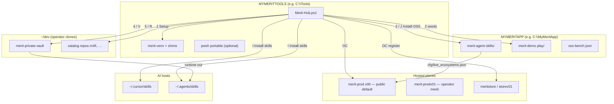
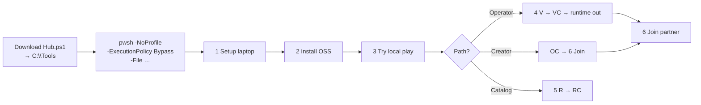
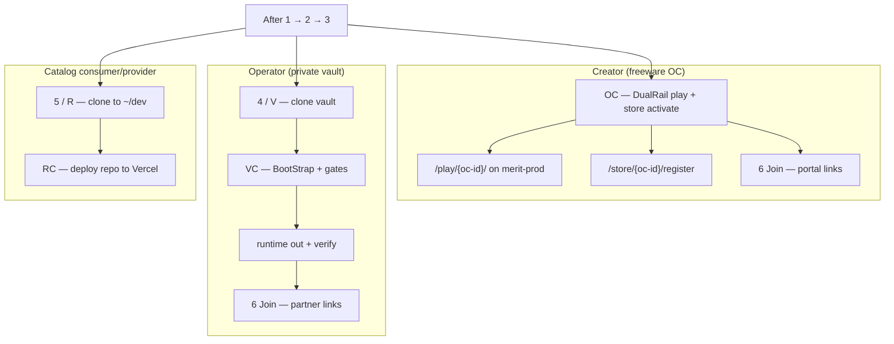

# Merit-Hub — one file

**Download one script:** [`Merit-Hub.ps1`](Merit-Hub.ps1) — standalone, no git, no folder, no `.json`, no extra launcher.

`C:\Tools` (or `%MYMERITTOOLS%`) is a **laptop folder**, not a git repo. Menu **1** installs `merit-venv` and shims on the machine; do not copy your Tools tree back into this repo.

**Embedded pins (current release):** `skills-v0.5.46` · `vault-v0.5.50` — see [CompatSet](#compatset--pins).

---

## How the pieces fit together



**Law:** Hub owns **cold start on one laptop**. Vault owns **policy + CompatSet**. Skills repo owns **OSS catalog + public docs**. Hosted v00 is the public bolt-on default until vault `publish_gate` promotes v01.

---

## Cold-start sequence



### Numbered steps (minimum)

1. Open [`Merit-Hub.ps1`](Merit-Hub.ps1) on GitHub → **Raw** → Save As `C:\Tools\Merit-Hub.ps1` (browser **Keep**).
2. Run this entire line (do **not** double-click):

```powershell
pwsh -NoProfile -ExecutionPolicy Bypass -File C:\Tools\Merit-Hub.ps1
```

3. First run: **Enter** for `MYMERITTOOLS` / `MYMERITAPP` (defaults `C:\Tools` / `C:\MyMeritApp`).
4. **1** Setup laptop — git / gh / pwsh + `merit-venv`.
5. **2** (alias **J**) Install OSS — clone skills pin + merit-demo + quiet smoke. OSS helpers reload automatically in the same session (no exit/reopen).
6. **3** Try it locally — open `merit-demo\play\index.html`.
7. Branch: **OC** (creator cloud) · **4/V** (vault local) · **5/R** (catalog clone).
8. **6** Join MERIT — after **OC** (store register) or after **4** (operator/partner). Not OC-only.

---

## Branch paths



| Path | Keys | Hosted? | Who |
|------|------|---------|-----|
| **Creator OC** | 2 → OC → 6 | Yes — merit-prod DualRail | Public creator |
| **Operator VC** | 2 → 4 → VC → 6 | No — vault stays private git | AgentDraven / partner |
| **Catalog** | 2 → 4 → 5 → RC | Yes — that repo's Vercel host | Consumer or provider |

---

## Full menu

Do **1** then **2** first. The Hub prints this map every run.

### Numbered keys

| Key | Action |
|-----|--------|
| **1** | Setup laptop — prereqs + MYMERIT* + merit-venv |
| **2** | Install OSS — skills pin + merit-demo + quiet smoke. Alias **J** |
| **3** | Try it — open local `play/index.html` |
| **OC** | OSS in the Cloud — DualRail play + **required** store activate + marketing site (`/play/site`). `-NewOc` mints a second `oc-*` id on this bench |
| **4** | Vault clone (local; working clone kept). Alias **V** |
| **VC** | Venture Capable — operator grade after **4** (BootStrap, gates, `runtime out`). Not a hosted vault |
| **5** | Catalog clone — consumer or provider. Alias **R** |
| **RC** | Deploy **that** catalog repo to its host (Vercel) — not OC |
| **6** | Join MERIT (sign up) — portal + register. After **OC** or after **4** |
| **0** | Stop |

### ALSO keys

| Key | Action |
|-----|--------|
| **P** | **Pristine v2** — wipe every known MYMERITAPP/MYMERITTOOLS path (incl. stale Process env + backup history), `~/dev`, MYMERIT* env (re-prompt next run), merit-venv. Keeps `C:\Tools\Merit-Hub.ps1` |
| **S** | **Soft** — bench + status cleanup; keep `~/dev` clones |
| **B** | **Backup only** — snapshot next to script |
| **I** | Install skills to AI host (Cursor, Codex, Hermes, …). Replaces per folder |
| **M** | Set MYMERITAPP bench path |
| **T** | Set MYMERITTOOLS root |
| **H** | Help — reprint menu |

CLI: `-InstallSkills Cursor` after **J** (same as menu **I**).

---

## CompatSet & pins

Merit-Hub embeds release pins — no separate JSON required:

| Pin | Repo | Role |
|-----|------|------|
| `skills-v0.5.43` | merit-agent-skills | OSS cold-start clone |
| `vault-v0.5.50` | merit-private-vault | Operator cold-start clone |

**Active CompatSet:** `2026.08.3` (vault `cfg/compat/`). F0+F1 + **m4fi** are **live-verified** on the operator laptop; F2–F4/FX rows are **inventory carry-forward** until each repo completes clone → git verify → mXin.

**Live ecosystems** ([`cfg/live_ecosystems.json`](../cfg/live_ecosystems.json)):

| Plane | Status in public skills copy | Bolt-on default? |
|-------|------------------------------|------------------|
| **v00** | `live_public` | Yes — merit-prod.vercel.app |
| **v01** | `coming_soon` | No — operator mesh exists; vault `publish_gate` not cleared |
| **hobby** | not listed | Never supported |

---

## Pristine preflight (operator)

Before menu **P** on a validation laptop:

1. Vault + skills at CompatSet pins (`git verify` PASS on both).
2. Download **fresh** Raw `Merit-Hub.ps1` (or confirm embedded pins match CompatSet).
3. **P** → **1** → **2** → optional **I** → **4/V** → **VC** → `runtime out` + `runtime verify` from vault clone.

Hub **P** does **not** wipe `%USERPROFILE%\.cursor\`; menu **I** replaces skill folders. `runtime out` merges vault-admin skills.

---

## Required: run the full command

After you save the file, **start it with this entire line**. Do **not** double-click `Merit-Hub.ps1`.

```powershell
pwsh -NoProfile -ExecutionPolicy Bypass -File C:\Tools\Merit-Hub.ps1
```

Windows treats an internet download as a security risk (unsigned script + **Mark of the Web**). `-ExecutionPolicy Bypass` applies to **this process only**. The script then **Unblock-File**s itself.

Browser / SmartScreen **“this file can harm your computer”** is expected — **Keep**.

Raw: `https://raw.githubusercontent.com/AgentDraven/merit-agent-skills/main/Merit-Hub/Merit-Hub.ps1`

---

## PowerShell 7 (pwsh)

Merit-Hub is written for **PowerShell 7+** (`pwsh`). Windows PowerShell 5.1 can start the file and re-launch `pwsh` when installed.

| Platform | Install |
|----------|---------|
| **Windows (winget)** | `winget install Microsoft.PowerShell` |
| **Windows (portable under Tools)** | Menu **1** → **[P]ortable** → `%MYMERITTOOLS%\pwsh\` + shim |
| **macOS** | `brew install powershell/tap/powershell` |
| **Linux** | [Microsoft docs](https://learn.microsoft.com/powershell/scripting/install/installing-powershell-on-linux) |

---

## VC is not a hosted vault

**4** clones the private vault onto this laptop. **VC** is operator grade: BootStrap, operator gates, `runtime out`.

**Protected** means **private GitHub remote**, not a public website:

1. `git remote -v` — AgentDraven private (mXin), never public origin.
2. `.\scripts\merit.ps1 git verify` — tag matches VERSION, tree clean.
3. `runtime out` then `runtime verify` — affiliate mirror.
4. Secrets in vault `env/` (not git).

**Validate VC:** Hub **4** → **VC** → four checks above from vault clone.

---

## Multi-creator benches (one PC)

A second **creator** is another OSS bench, not another Tools tree.

```powershell
pwsh -NoProfile -File C:\MyMeritApps\merit-agent-skills\Merit-Hub\oc-bench.ps1 `
  -Name creator-01 -ProductName 'Creator 01 DualRail' -All
```

Each bench: `%MYMERITAPP%` = `C:\MyMeritApps\benches\<name>` with its own `oss-bench.json` / `ocConsumerId`. `MYMERITTOOLS` stays shared. Hub **OC -NewOc** mints a second OC from one bench.

Cloud isolation is `consumer_id` on merit-prod (v0.1.84+).

---

## What the script creates locally

| Path | When |
|------|------|
| `backups\` | Next to the script |
| `%MYMERITTOOLS%\pwsh\` | Menu **1 → Portable** (optional) |
| `%MYMERITTOOLS%\merit-venv\` | Menu **1** |
| `%MYMERITAPP%\merit-agent-skills\` | Menu **J** or **2** |
| `%MYMERITAPP%\oss-bench.json` | Laptop status (OC URLs, etc.) |
| `~/.cursor/skills\` (etc.) | Menu **I** / `-InstallSkills` |
| `~/dev/{persona}/{repo}` | Menu **4**, **5** |

Hub does **not** create `%MYMERITAPP%\BootStrap\` or `MERIT_BootStrap.cmd` (retired).

---

## Hub baseline

Keys **1 2 3 OC 4 VC 5 R RC 6** and **P S B I M T** are wired on current Hub. Freemium smoke lives in repo `scripts/smoke-freemium.ps1` (not a Hub menu key).
