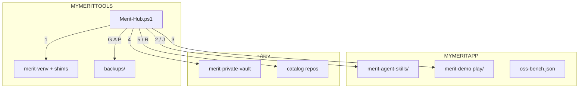

# Merit-Hub — one file

**Download one script:** [`Merit-Hub.ps1`](Merit-Hub.ps1) — standalone, no git, no folder, no `.json`, no extra launcher.

`%MYMERITTOOLS%` (e.g. `C:\Tools` or `C:\DevTools`) is a **laptop folder**, not a git repo. Menu **1** installs `merit-venv` and shims on the machine; do not copy your Tools tree back into this repo.

**Embedded pins (current release):** `skills-v0.5.66` · `vault-v0.5.56` — see [CompatSet](#compatset--pins).

**Raw download:** `https://raw.githubusercontent.com/AgentDraven/merit-agent-skills/main/Merit-Hub/Merit-Hub.ps1`

---

## If you want to… (personas)

| If you want to… | Then |
|-----------------|------|
| **Cold-start MERIT on a new laptop** | Download Raw `Merit-Hub.ps1` → `C:\Tools\` (any folder; `MYMERITTOOLS` need not exist yet) → run full `-File` line → **1** → **2** (skills) → **3** (demo) |
| **Publish a creator app in the cloud (no vault)** | After **2** → **OC** → **6** Join |
| **Work as vault operator (AgentDraven / partner)** | After **2** → **4** → **VC** → `runtime out` + `runtime verify` → **6** |
| **Clone and deploy a catalog repo (m4fi, …)** | After **2** → **5** → **RC** |
| **Install MERIT skills into Cursor / Codex / etc.** | After **2** → **I** (or `-InstallSkills Cursor`) |
| **See what is on this laptop (A+B+C+D+H)** | **W** or `-Surface` |
| **Preview leftover MERIT folders before cleanup** | **G** or `-SprawlScan` (no changes) |
| **Archive laptop state without wiping** | **A** or `-PrePristine` |
| **Full reset and walk cold-start again** | Fresh Raw Hub → **G** (optional) → **A** → **P** → **1** → **2** → **3** |
| **Wipe bench only; keep `~/dev` clones** | **S** or `-Soft` |
| **Change where OSS bench or tools live** | **M** (`MYMERITAPP`) or **T** (`MYMERITTOOLS`) |
| **Second creator on same PC** | Separate `MYMERITAPP` bench + [`oc-bench.ps1`](oc-bench.ps1) or Hub **OC -NewOc** |

---

## Recommended sequences

### New laptop (first time)

```text
Download Hub to C:\Tools (MYMERITTOOLS need not exist yet)
→ cd C:\Tools
→ pwsh -NoProfile -ExecutionPolicy Bypass -File .\Merit-Hub.ps1
→ 1 Setup → 2 Install OSS (skills pin) → 3 Try it (public merit-demo) → (OC | 4 | 5) → 6 Join
→ type 0 at Select when done (Hub stays open until 0)
```

### Messy laptop (sprawl from testing MYMERIT* names)

```text
Fresh Raw Hub → G (sprawl preview) → A (archive + sprawl review) → P (wipe) → 1 → 2 → 3 → W
```

### Operator validation laptop

```text
A → -Help (confirm pin) → P → 1 → 2 → I → 4 → VC → runtime out/verify
```

### Cleanup-only (no full wipe)

```text
G → A    (or S for bench-only soft cleanup)
```

---

## How the pieces fit together



**Law:** Hub owns **cold start on one laptop**. Vault owns **policy + CompatSet**. Skills repo owns **OSS catalog + public docs**.

---

## Cold-start sequence

<a id="cold-start-sequence"></a>

1. Open [`Merit-Hub.ps1`](Merit-Hub.ps1) on GitHub → **Raw** → Save As `C:\Tools\Merit-Hub.ps1` (browser **Keep**). `%MYMERITTOOLS%` need not exist yet; menu **1** persists it.
2. From that folder, run this entire line (do **not** double-click):

```powershell
cd C:\Tools
pwsh -NoProfile -ExecutionPolicy Bypass -File .\Merit-Hub.ps1
```

3. First run: **Enter** for `MYMERITTOOLS` / `MYMERITAPP` defaults (or pick your own paths).
4. **1** Setup laptop — git / gh / pwsh + Python (**V**env under tools, **G**lobal shim, or **S**kip).
5. **2** (alias **J**) Install OSS — clone skills pin only (no merit-demo).
6. **3** Try it — clone public [`Mr-PI-Bala/merit-demo`](https://github.com/Mr-PI-Bala/merit-demo) (no GitHub login) and open `play\index.html`.
7. Branch: **OC** · **4** (vault) · **5** (catalog).
8. **6** Join MERIT — after **OC** or after **4**.
9. Type **0** at **Select** when done. Hub stays open after steps; do not rely on closing the window.

---

## Full menu reference

Do **1** then **2** then **3** first unless you are only running cleanup keys (**G A P S**).

### Numbered keys (cold start)

| Key | CLI flags | Action |
|-----|-----------|--------|
| **1** | `-Prereqs` | Setup laptop — git, gh, pwsh, persist `MYMERIT*`, Python (**V**env / **G**lobal shim / **S**kip) |
| **2** | `-Jumpstart Oss`, `-InstallOss`, `-OssPhase`, **J** | Install OSS — skills pin only (no merit-demo) |
| **3** | `-TryIt` | Clone public `Mr-PI-Bala/merit-demo` + open `play\index.html` |
| **OC** | `-Oc`, `-NewOc` | OSS in the Cloud — DualRail play + store activate |
| **4** | `-Jumpstart Vault` | Clone private vault (local working copy) |
| **VC** | `-Vc` | Venture Capable — operator BootStrap + gates (after **4**) |
| **5** | `-R` | Catalog clone — consumer or provider role |
| **RC** | `-Rc` | Deploy **that** catalog repo to its host (Vercel) — not OC |
| **6** | `-JoinMerit` | Portal / register links — after **OC** or **4** |
| **0** | — | Stop |

### Cleanup keys (ALSO)

| Key | CLI flags | Archive? | Wipe? | When to use |
|-----|-----------|----------|-------|-------------|
| **G** | `-SprawlScan`, `-VestigialScan` | No | No | Preview leftover MERIT roots, duplicate skills clones, stale Hub copies |
| **A** | `-PrePristine`, `-BackupOnly`, **B** | Yes | No | Save env + Hub + oss-bench + sprawl archive; refresh Tools Hub |
| **P** | `-Pristine`, `-Force` | Yes | Full | Cold-start reset; keeps canonical Tools Hub + `backups\` |
| **S** | `-Soft` | Yes | Bench only | Clear bench/status; keep `~/dev` clones |

**Sprawl review flow (built into A and P):** Hub lists vestigial paths → prompt `[y/N/review]` → moves accepted items to `backups\<stamp>\vestigial-archived\` → writes `vestigial-scan.json`. Protected: `Setup_LocalModels*`, `backups\`, canonical `MYMERIT*` trees.

### Utility keys

| Key | CLI flags | Action |
|-----|-----------|--------|
| **I** | `-InstallSkills <host>` | Copy `skills/` to Cursor, Codex, Hermes, … (after **2**) |
| **M** | — | Set `MYMERITAPP` bench path |
| **T** | — | Set `MYMERITTOOLS` root |
| **W** | `-Surface` | Where / Surface — A+B+C+D+H diagnostic map |
| **H** | `-Help` | Reprint menu |

---

## CLI reference (non-interactive)

```powershell
# Cold start
pwsh -NoProfile -ExecutionPolicy Bypass -File $env:MYMERITTOOLS\Merit-Hub.ps1 -Prereqs
pwsh -NoProfile -ExecutionPolicy Bypass -File $env:MYMERITTOOLS\Merit-Hub.ps1 -InstallOss
pwsh -NoProfile -ExecutionPolicy Bypass -File $env:MYMERITTOOLS\Merit-Hub.ps1 -TryIt

# Cleanup
pwsh -NoProfile -ExecutionPolicy Bypass -File $env:MYMERITTOOLS\Merit-Hub.ps1 -SprawlScan
pwsh -NoProfile -ExecutionPolicy Bypass -File $env:MYMERITTOOLS\Merit-Hub.ps1 -PrePristine
pwsh -NoProfile -ExecutionPolicy Bypass -File $env:MYMERITTOOLS\Merit-Hub.ps1 -Pristine
pwsh -NoProfile -ExecutionPolicy Bypass -File $env:MYMERITTOOLS\Merit-Hub.ps1 -Soft

# Branch paths
pwsh -NoProfile -ExecutionPolicy Bypass -File $env:MYMERITTOOLS\Merit-Hub.ps1 -Oc
pwsh -NoProfile -ExecutionPolicy Bypass -File $env:MYMERITTOOLS\Merit-Hub.ps1 -Jumpstart Vault
pwsh -NoProfile -ExecutionPolicy Bypass -File $env:MYMERITTOOLS\Merit-Hub.ps1 -Vc
pwsh -NoProfile -ExecutionPolicy Bypass -File $env:MYMERITTOOLS\Merit-Hub.ps1 -R -Role consumer
pwsh -NoProfile -ExecutionPolicy Bypass -File $env:MYMERITTOOLS\Merit-Hub.ps1 -InstallSkills Cursor
pwsh -NoProfile -ExecutionPolicy Bypass -File $env:MYMERITTOOLS\Merit-Hub.ps1 -Surface
```

---

## Branch paths

| Path | Keys | Hosted? | Who |
|------|------|---------|-----|
| **Creator OC** | 2 → OC → 6 | Yes — merit-prod DualRail | Public creator |
| **Operator VC** | 2 → 4 → VC → 6 | No — vault stays private git | AgentDraven / partner |
| **Catalog** | 2 → 5 → RC | Yes — that repo's Vercel host | Consumer or provider |

---

## Pristine restart (from zero)

1. **Fresh Hub (mandatory)** — download Raw and overwrite `%MYMERITTOOLS%\Merit-Hub.ps1`. Confirm `-Help` shows current pin.
2. **G** (optional) — sprawl preview only.
3. **A** — archive + sprawl review; no wipe.
4. **P** — same archive pack, then full wipe (type `PRISTINE`).
5. **1 → 2 → 3** — cold start.
6. **W** — verify surface; `merit.ps1 where` + `merit.ps1 law closeout` from bench clone.
7. **I** (optional) — refresh IDE skill folders.

Hub **P** does not delete `%USERPROFILE%\.cursor\` wholesale; use **I** for skill refresh.

---

## CompatSet & pins

| Pin | Repo | Role |
|-----|------|------|
| `skills-v0.5.66` | merit-agent-skills | OSS cold-start clone |
| `vault-v0.5.56` | merit-private-vault | Operator cold-start clone |

**Active CompatSet:** `2026.08.3` (vault `cfg/compat/`).

---

## Required: run the full command

```powershell
pwsh -NoProfile -ExecutionPolicy Bypass -File $env:MYMERITTOOLS\Merit-Hub.ps1
```

Windows treats internet downloads as unsigned scripts. `-ExecutionPolicy Bypass` is for **this process only**. Browser **Keep** when prompted.

---

## PowerShell 7 (pwsh)

Merit-Hub requires **PowerShell 7+**. Menu **1** can install portable `pwsh` under `%MYMERITTOOLS%\pwsh\`.

---

## VC is not a hosted vault

**4** clones the private vault. **VC** is operator grade: BootStrap, gates, `runtime out`. Protected = private GitHub remote, not a public website.

---

## Multi-creator benches

See [`oc-bench.ps1`](oc-bench.ps1). Each bench gets its own `MYMERITAPP` + `oss-bench.json`; `MYMERITTOOLS` stays shared.

---

## What the script creates locally

| Path | When |
|------|------|
| `%MYMERITTOOLS%\backups\` | **A**, **P**, **S** |
| `%MYMERITTOOLS%\merit-venv\` | **1** (if you choose Venv) |
| `%MYMERITTOOLS%\merit-python.cmd` | **1** (venv or global shim) |
| `%MYMERITAPP%\merit-agent-skills\` | **2** |
| `%MYMERITAPP%\oss-bench.json` | **2** |
| `%MYMERITAPP%\merit-demo\` | **3** |
| `~/dev/{persona}/{repo}` | **4**, **5** |
| `~/.cursor/skills\` (etc.) | **I** |

---

## Hub baseline

**Cold start:** `1 2 3 OC 4 VC 5 R RC 6` · **Cleanup:** `G A P S` · **Util:** `I M T W H`

Freemium smoke: repo `scripts/smoke-freemium.ps1` (not a Hub menu key).

IAR: [MAS-IAR-HUB-PP-01](../docs/IAR/MAS-IAR-HUB-PP-01.md) · [MAS-IAR-HUB-PP-02](../docs/IAR/MAS-IAR-HUB-PP-02.md) · [MAS-IAR-HUB-PP-03](../docs/IAR/MAS-IAR-HUB-PP-03.md)
