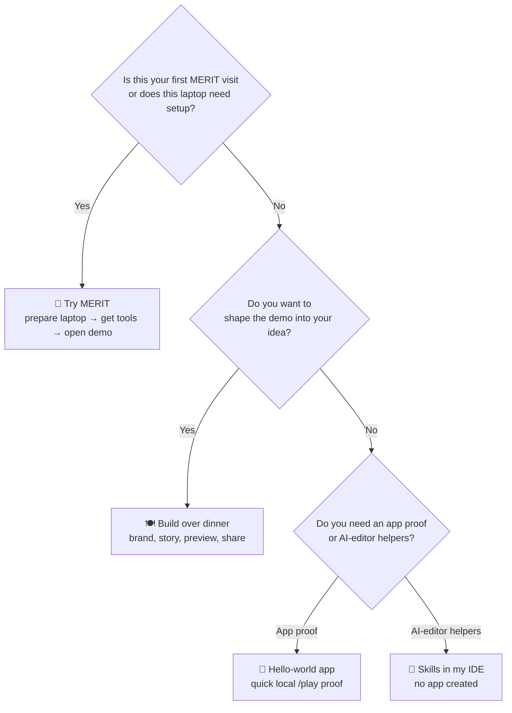

# merit-agent-skills

Free **MERIT agent skills** and **`merit`** CLI � one-stop OSS cold start for **Cursor**, **Claude Code**, **Codex**, **VS Code / Open Agents**, **Hermes**, **OpenClaw**, **Grok Bot**, **Devin**, and more agent harnesses (see [Collaboration](#collaboration--suggest-a-host)).

### Peel-The-Onion beginner guide 🧅

Every beginner pathway is explained in three layers: **Start**, **Make progress**, and **Finish**. Each layer shows the action, what MERIT does for you, and the evidence to look for.

**Quick index:** [Choose your adventure](#which-adventure-fits-you-) · [Start paths](#start-here--pick-your-adventure) · [Peel-The-Onion cards](#peel-the-onion-cards-three-steps-three-checks-each-) · [Additional options](#-for-additional-options) · [Public vs private SSOT](#public-vs-private-ssot) · [Quick install](#-quick-install) · [Dinner walkthrough](#-build-your-app-over-dinner)

## Which adventure fits you? 🧭

Pick the outcome you want—not a command you have to decode. Every route is safe to repeat; the Hub keeps the setup work in one place.



- **🚀 Try MERIT** — the complete first-time trip: the Hub prepares the laptop, installs OSS, and opens a working demo.
- **👋 Hello-world app** — the shortest local proof when setup is already complete: open `/play/`, see **Hosted Ready**, and use the workbench.
- **🍽️ Build over dinner** — the creative route: give the demo your name, story, and branding, then preview or share it.
- **🧠 Skills in my IDE** — installs MERIT helpers into your AI editor. It helps with the other routes but does not create an app by itself.

> **Recommended first trip:** choose **🚀 Try MERIT**, then follow **Set up this laptop (1) → Get the free tools (2) → Try it (3) → Validate my local demo (3V) → OSS in Cloud (OC) → Walk through my hosted demo (OCV)**. Pick **👋 Hello-world** only when your laptop is already prepared and the free tools are installed.

<a id="start-here--pick-your-adventure"></a>
<table><tr><td bgcolor="#1f6feb"><strong><big><big>🧭 Start here — pick your adventure</big></big></strong></td></tr></table>

> **Choose one row, then read left to right.** Every path starts with the Hub; IDE skills are an optional helper, not a surprise extra step.

| Path | 1. Start | 2. Make progress | 3. Finish |
|---|---|---|---|
| 🚀 [I want to try MERIT](#i-want-to-try-merit) | Open PowerShell | Run the Hub | Choose the demo |
| 🍽️ [I want to build over dinner](docs/howto/launch-over-dinner.md) | Start the Hub | Personalize `merit-demo` | Preview and share |
| 👋 [I want a hello-world app](#i-want-a-hello-world-app) | Open `merit-demo` | Run `quickstart` | Open `/play/` |
| 🧠 [I want skills in my IDE](#i-want-skills-in-my-ide) | Pick your host | Run Hub **I** | Verify the skills |

> IDE skills are an optional helper for the try, dinner, and hello-world paths.

### Peel-The-Onion cards: three steps, three checks each 🧅

#### 🚀 I want to try MERIT

1. **Start** — open PowerShell, run `\.\Merit-Hub.ps1`, then choose **Set up this laptop (1)** and **Get the free MERIT tools (2)**.
   - The Hub checks what this laptop needs.
   - The Hub downloads a tested-together version of the free tools.
   - The receipt shows where the tools were placed and which version was used.
2. **Make progress** — choose **3 Try it**.
   - Hub reuses a clean local demo.
   - HTTP server starts on the reusable port.
   - Browser opens `/play/`.
3. **Finish** — run **3V**, then optionally **O → OC**.
   - Confirm Hosted Ready and workbench mounted.
   - Check Register free and portal links.
   - Receipt records URLs and validation status.

#### 🍽️ I want to build over dinner

1. **Start** — follow the [dinner walkthrough](docs/howto/launch-over-dinner.md).
   - Run the Hub from PowerShell.
   - Choose a demo and friendly product name.
   - Keep accounts optional for the first night.
2. **Make progress** — personalize the consumer.
   - Edit branding and story fields.
   - Preview through the local HTTP server.
   - Run verification after each change.
3. **Finish** — validate and share the idea.
   - Run the local check and review the receipt.
   - Choose a Journal or AMA surface.
   - Publish only after hosted checks pass.

#### 👋 I want a hello-world app

1. **Start** — open `merit-demo` and run quickstart.
   - The scaffold loads the pinned workbench.
   - No vault or cloud account is required.
   - The command prints the local URL.
2. **Make progress** — explore `/play/`.
   - Confirm “Hello, meritutils”.
   - Confirm Hosted Ready and mounted workbench.
   - Try guest controls and navigation.
3. **Finish** — repeat with **3V** when ready.
   - Validate routes one by one.
   - Capture screenshots or receipt evidence.
   - Stop with `0` when finished.

#### 🧠 I want skills in my IDE

1. **Start** — run `Merit-Hub.ps1` and choose **Install skills in my AI editor (I)**.
   - Select your host.
   - Hub checks the adapter and target.
   - Unrelated settings are preserved.
2. **Make progress** — use the installed skills.
   - Ask the IDE to help with your MERIT project.
   - Use the project’s own check list when you finish work.
   - Treat unsupported hosts as guidance-only.
3. **Finish** — verify the installation.
   - Re-run **I** if the pin changes.
   - Check host status or warning receipt.
   - Keep consumer code independent from IDE files.

### 🧰 For additional options

Use the [dinner walkthrough](docs/howto/launch-over-dinner.md), [plain-English usage guide](docs/usage.md), [deployment guide](docs/deploy.md), or [choose-a-path guide](docs/TRY_BUNDLES.md).

<details><summary>Reference map and advanced options</summary>

| Goal | Path |
|------|------|
| **Live ecosystems (bolt-on targets)** | [`cfg/live_ecosystems.json`](cfg/live_ecosystems.json) � default **v00** until vault publishes **v01** as `live_public`. Hobby is never listed. |
| **Laptop hub (easiest cold start)** | **[Download `Merit-Hub.ps1`](Merit-Hub/Merit-Hub.ps1)**, open Windows PowerShell or PowerShell 7, change to its folder, and run ` .\Merit-Hub.ps1`. The ` .\` prefix is required by PowerShell for a script in the current folder. The Hub detects Windows PowerShell 5.1, installs/launches `pwsh` when needed, and guides **1** → **2** → **3** (optional **OC**). Full menu + personas: [Merit-Hub/README.md](Merit-Hub/README.md). |
| **Build over dinner (start here)** | **[docs/howto/launch-over-dinner.md](docs/howto/launch-over-dinner.md)** — 3 steps, no accounts night one |
| **How the free tools arrive** | Choose **Get the free MERIT tools (2)**. The Hub downloads the tested-together release; you do not choose a Git tag. |
| **Usage (accounts and hosting)** | [docs/usage.md](docs/usage.md) |
| **Launch/deploy PoV** | [docs/deploy.md](docs/deploy.md) — one local `.merit_launch.md`, one `merit` command |
| **LLD map (audit)** | [docs/IAR/MERIT_AGENT_SKILLS_LLD_MAP.md](docs/IAR/MERIT_AGENT_SKILLS_LLD_MAP.md) |
| **Full freemium showcase** | [Mr-PI-Bala/merit-demo](https://github.com/Mr-PI-Bala/merit-demo) — workbench, journal, AMA, subs, legal |
| **Independent example app** | [Mr-PI-Bala/merit-test](https://github.com/Mr-PI-Bala/merit-test) — a separate example used by maintainers to check shared services |
| **Choose a try path** | [docs/TRY_BUNDLES.md](docs/TRY_BUNDLES.md) |
| **Skills only** | Merit-Hub menu **I** or `pwsh -NoProfile -ExecutionPolicy Bypass -File C:\Tools\Merit-Hub.ps1 -InstallSkills Cursor` (after **J**). Or from cloned repo: `.\merit.ps1 skills install --target Cursor|ClaudeCode|Codex|VSCode|Hermes|OpenClaw|GrokBot|Devin` |
| **Mini upgrade (mmUpgrade)** | `/merit-mm-upgrade` or say **mmUpgrade** — gap analysis → FR/AGENT_REQ (no vault) |
| **Referral / design partner** | [`skills/merit-referral`](skills/merit-referral/SKILL.md) — free attribution + portal recipes (no billing) |
| **Live alpha elevate** | `.\merit.ps1 livealpha --path <consumer>` then Cursor `/merit-livealpha …` |

</details>

**Production MERIT base (skills default):** `https://merit-prod.vercel.app` (**v00** in [`cfg/live_ecosystems.json`](cfg/live_ecosystems.json)). Operator **v01** hosts exist but are not the skills default until vault `publish_gate` promotes them. Portfolio consumers such as SoulOS, SomaTune, DIRT, M4FI, and AURAVYBE stay separate.

<a id="public-vs-private-ssot"></a>
<table><tr><td bgcolor="#6f42c1"><strong><big><big>🔐 Public vs private SSOT</big></big></strong></td></tr></table>


| | Public (this repo + Portal) | Private (operators only) |
|--|----------------------------|--------------------------|
| **What** | Skills, `merit` CLI recipes, dinner/tutorial, freemium docs | Full platform **product law**, L1, env, cert registry |
| **Where** | **This README**, [docs/usage.md](docs/usage.md), [docs/howto/launch-over-dinner.md](docs/howto/launch-over-dinner.md), [Merit-Hub/README.md](Merit-Hub/README.md), live [Portal](https://merit-prod.vercel.app/portal/) | Vault `docs/PRD_MERIT_AGENT_SKILLS_PLATFORM.md` (**ACCEPTED** technical SSOT — not published here) |
| **Who** | Builders, agents on OSS path | Affiliate Owner (**MeritAcmeOwner** default) / AgentDraven with vault |
| **Pin** | Clone **`skills-v*`** release tags (FR-SK-14 / L1 §E.0) | Not a substitute for product VERSION on consumers |

**Do not** expect a public copy of the vault PRD. Implementers with vault access apply FR tables from the private PRD + provider IAR; builders follow **usage + Portal** only.

**Same names, different jobs** (not vestigial; do not overwrite each other):

| File | What it is | What it is not |
|------|------------|----------------|
| This repo **`merit.ps1` / `merit.sh`** | Public OSS CLI (`create` / `apply` / `verify` / `portal` / consumer `closeout`) | Vault operator CLI |
| Vault **`scripts/merit.ps1`** | Operator CLI (`mXin`, `runtime`, `env`, hygiene) | Public create/deploy CLI |
| This repo **`cfg/oss-bench.template.json`** | Template field names for the laptop status file | Live laptop state (that is `%MYMERITAPP%\oss-bench.json`) |
| Vault operator state | Vault-only operator template and runtime state | Public OSS registry |
| **`oss-bench.json`** | Live machine bench state after first run | A committed repo file |

<table><tr><td bgcolor="#0d9488"><strong><big><big>⚡ Quick install</big></big></strong></td></tr></table>


**Recommended cold start:** [download `Merit-Hub.ps1`](Merit-Hub/Merit-Hub.ps1) (**Raw**) to a tools folder such as `C:\Tools`, open Windows PowerShell or PowerShell 7, and run:

```powershell
cd C:\Tools
.\Merit-Hub.ps1
```

### 🍽️ Build Your App Over Dinner


Follow [🍽️ Build Your App Over Dinner](docs/howto/launch-over-dinner.md). It turns the three rows above into three tiny actions each.

The ` .\` prefix matters: PowerShell does not execute a script from the current directory when you type only its filename. The Hub handles the PowerShell-version check and offers to install/launch PowerShell 7 when only Windows PowerShell is available. Menu **2** / **J** downloads the approved OSS tools for you—there is no release tag or Git command to choose. Cleanup keys (**G** sprawl scan, **A** archive, **P** pristine): [Merit-Hub/README.md](Merit-Hub/README.md).

**Fresh-device check:** after Hub **2 → 3**, open the seeded demo and run `.\merit.ps1 where`, `.\merit.ps1 verify`, then `.\merit.ps1 serve`. Open `/play/` and confirm **Hosted Ready**, the mounted workbench, and **Register free**. Use `.\merit.ps1 closeout` for the full release gate.

**No Git commands needed:** Hub **1 → 2 → 3** creates the local tools and demo. Once Hub **2** is complete, use the installed `merit.ps1` from the skills folder only for named checks such as `where`, `verify`, `serve`, and `closeout`.

<table><tr><td bgcolor="#0d9488"><strong><big><big>🧩 Multi-runtime install (same `skills/` tree)</big></big></strong></td></tr></table>


| Runtime | Status | Install |
|---------|--------|---------|
| **Cursor** | supported | `.\merit.ps1 skills install --target Cursor` ? `~/.cursor/skills` |
| **Claude Code** | supported | `.\merit.ps1 skills install -Target ClaudeCode` ? `~/.claude/skills` (alias: `Claude`) |
| **Codex** | supported | `.\merit.ps1 skills install -Target Codex` ? `~/.codex/skills` (or `$CODEX_HOME/skills`) |
| **VS Code / Open Agents** | supported | `.\merit.ps1 skills install -Target VSCode` ? `~/.agents/skills` (alias: `Agents`) |
| **Hermes** | supported | `.\merit.ps1 skills install -Target Hermes` ? `~/.hermes/skills` � or `hermes skills tap add AgentDraven/merit-agent-skills` |
| **OpenClaw** | supported | `.\merit.ps1 skills install -Target OpenClaw` ? `~/.openclaw/skills` � or `openclaw skills install ./skills/<skill>` |
| **Grok Bot** | supported | `.\merit.ps1 skills install -Target GrokBot` ? `~/.grok/skills` (alias: `Grok`) |
| **Devin** | supported | `.\merit.ps1 skills install -Target Devin` ? `~/.devin/skills` + repo `AGENTS.md` in cloud sessions |
| **Project (Cursor)** | supported | `.\merit.ps1 skills install -Target Project -Path <repo>` ? `<repo>/.cursor/skills` |
| **Paperclip** | research | � (suggest via email below) |

Registry source of truth: [`cfg/agent_hosts.json`](cfg/agent_hosts.json).

<a name="collaboration--suggest-a-host"></a>
## Collaboration — suggest a host 🤝

MERIT aims to be the **one-stop** public path for builders on **any** AI IDE, agentic harness, or autonomous agent � not just the hosts above.

**Missing your stack?** Email **[meritlabs@protonmail.com](mailto:meritlabs@protonmail.com?subject=MERIT%20host%20suggestion)** with:

- Host / product name (e.g. your IDE, CLI agent, or cloud agent)
- Where skills or instructions are loaded from (path, env var, or doc link)
- Whether you want file-copy install (`merit.ps1 skills install --target �`) or CLI-only integration

When a suggested host is ready, we add it to [`cfg/agent_hosts.json`](cfg/agent_hosts.json) and make the Hub installer available. You only need to tell us which tool you use and where it expects skills to live.

<table><tr><td bgcolor="#0d9488"><strong><big><big>🛠️ One public CLI</big></big></strong></td></tr></table>


```powershell
.\merit.ps1 init --path ..\my-app
# edit ..\my-app\.merit_launch.md
.\merit.ps1 apply --path ..\my-app
.\merit.ps1 verify --path ..\my-app
```

Optional BYOK publish/deploy:

```powershell
.\merit.ps1 deploy --path ..\my-app
.\merit.ps1 portal --path ..\my-app
```

Linux/macOS:

```bash
./merit.sh init --path ../my-app
# edit ../my-app/.merit_launch.md
./merit.sh apply --path ../my-app
./merit.sh verify --path ../my-app
```

Shell wrappers require `pwsh` or PowerShell.

Smokes: Windows `.\scripts\smoke-freemium.ps1`; Linux/macOS `./scripts/smoke-freemium.sh`.

<table><tr><td bgcolor="#0d9488"><strong><big><big>🧪 E2E Testing Using Playwright (optional)</big></big></strong></td></tr></table>


The public quickstart does not require extra developer tooling. For the optional full visual check in `merit-demo`, use the MERIT helper:

```powershell
.\merit.ps1 e2e
```

Linux/macOS:

```bash
./merit.sh e2e
```

The MERIT helper runs the demo checks and writes screenshots under `merit-demo docs/evidence/` when the optional browser tools are available. If that optional check is unavailable, the normal `verify` and Hub **3V** path still provide the standard proof.

<table><tr><td bgcolor="#0d9488"><strong><big><big>🧠 Skills</big></big></strong></td></tr></table>


| Skill | Purpose |
|-------|---------|
| `merit-par-workbench` | DualRail Gloss play (`merit_ux` + Value Tour) + Advanced `merit_workbench` / `journal` |
| `merit-prd` | Bake `*prd.md` (marketing + FR matrix) before portal / `app_logic/` |
| `merit-applogic` | Implement Must FRs under `app_logic/` from PRD + portal (`/merit-applogic`) |
| `merit-portal` | here.now marketing (`portal/` only); multi-surface |
| `merit-subs` | meritsubs + meritstore funnel, freemium caps |
| `merit-ama` | AMA Q&A + leaderboard (merit-demo) |
| `merit-admin-gate` | MeritAdminGate phrase auth |
| `merit-deploy-vercel` | Scoped Vercel deploy (your team scope) |
| `merit-onboard` | OSS quickstart → merit-demo |
| `meritcert`, `merit-closeout`, `merit-iar` | Vocabulary; vault operators run writes |

`merit.ps1 create` (v0.3.31+): **Cloud First** — live `merit-prod` `/apps/<app>/play`. Phase 7 jumpstart portal + PRD include Make Art, ecosystem providers, PAR packages, and consumer examples (CAST = Cloud-Assisted Autonomous Synth-Podcast Theatre, DIRT, SomaTune, M4FI, Tranquil Balance). Phase 8 publishes portal/ to here.now when credentials exist.

All OSS user docs use **`.\merit.ps1`** / **`./merit.sh`**. There are no public shim scripts.

<table><tr><td bgcolor="#0d9488"><strong><big><big>💎 Freemium vs Plus</big></big></strong></td></tr></table>

| | Free (OSS) | Plus |
|---|------------|------|
| PAR | `merit_workbench@0.4.x`, `journal@0.2.x` | `@1.0.x` commercial line (Phase 3 gate) |
| Journal | 2 entries/day | Uncapped |
| AMA | 2 ask/vote/response/day; top 25 | Uncapped |
| CLI | merit.ps1 / merit.sh | + vault merit.ps1 for operators |
| Commerce | — | meritstore + meritsubs on **your** `consumer_id` |

Plus: **$10.79/mo** ($2.49/wk round up); 20% off 6-month; 50% off annual.

### Guest → paid funnel

Guest OSS PAR → free register (meritstore) → hit freemium cap → **Plus** SKU → meritsubs entitlements. See [docs/TRY_BUNDLES.md](docs/TRY_BUNDLES.md).

<table><tr><td bgcolor="#0d9488"><strong><big><big>🚀 Releases</big></big></strong></td></tr></table>

| Policy | Detail |
|--------|--------|
| Pre-GA tags | `skills-v0.x.y` — minor bumps in this program |
| GA | `skills-v1.0.0` when the **Affiliate Owner** approves (this program: HumanBala) |
| Pin | Release tags, not floating `main` (L1 §E.0 / FR-SK-14) |
| Current public CLI / Hub release | **`skills-v0.5.195`** |
| Historical human-validation baseline | **`skills-v0.5.63`**; no new human-validation claim in this patch |

Phase 1 shipped skills-only (`skills-v0.1.0`). Freemium merit CLI is pre-GA until dogfood smokes green.

<table><tr><td bgcolor="#0d9488"><strong><big><big>📜 Licensing (product fork)</big></big></strong></td></tr></table>

Apache-2.0 adoption on skills; monetization via meritstore — not license royalties. See **`LICENSING.md`**, **`THIRD_PARTY_NOTICES.md`**.

<table><tr><td bgcolor="#0d9488"><strong><big><big>🔄 Sync from vault</big></big></strong></td></tr></table>

Exported from `merit-private-vault/templates/skills/` at release time.
# Developer repository access

Public cloning does not require write access. To let a developer account push to a repository, the repository owner or an administrator must run:

```powershell
gh api --method PUT repos/Mr-PI-Bala/merit-demo/collaborators/AgentDraven `
  --field permission=push
```

Replace the owner, repository, and account as needed. The command must be run by an account with repository administration rights; a token's `repo` scope alone does not grant collaborator access. Verify the effective permission with:

```powershell
gh api repos/Mr-PI-Bala/merit-demo --jq '.permissions'
```

The result must include `"push": true`. If the owner cannot grant access, fork the repository and point `origin` at the writable fork instead.

Equivalent MERIT admin commands (run from the target repository; repo/user/permission are prompted or inferred):

```powershell
.\merit.ps1 admin github access add
.\merit.ps1 admin github access status
.\merit.ps1 admin github access remove
```
