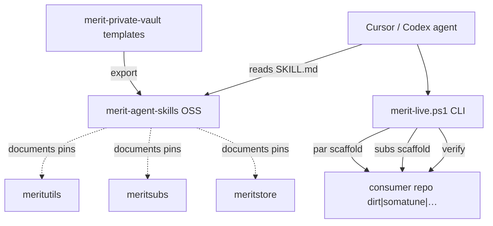

# merit-agent-skills — Low-Level Design Map (LLD_MAP)

**Document ID:** MAS-IAR-LLD-001  
**Repo:** `AgentDraven/merit-agent-skills` (OSS public distribution)  
**Platform PRD:** `merit-private-vault/docs/PRD_MERIT_AGENT_SKILLS_PLATFORM.md`  
**Usage:** [docs/usage.md](../usage.md) · [README.md](../../README.md)

| Field | Value |
|-------|-------|
| **MERIT role** | **Enablement / scaffolding** — not a vault registry runtime provider |
| **Exports from** | `merit-private-vault/templates/skills/` at release |
| **Targets** | Any MERIT-shaped consumer repo + OSS adopters |

---

<a id="purpose"></a>
## 1. Purpose & scope ^purpose

LLD map for the **public agent skills layer**: Cursor/Codex skill files, `merit-live` CLI, consumer static templates, freemium cfg — wiring agents to meritsubs, meritutils PAR, meritstore, here.now, Vercel.

---

<a id="ascii-tree"></a>
## 2. ASCII tree ^ascii-tree

```
merit-agent-skills/
├── skills/                      # One folder per skill (SKILL.md)
│   ├── merit-par-workbench/
│   ├── merit-portal/
│   ├── merit-subs/
│   ├── merit-ama/
│   ├── merit-admin-gate/
│   ├── merit-deploy-vercel/
│   ├── merit-onboard/
│   ├── meritcert/
│   ├── merit-closeout/
│   └── merit-iar/
├── templates/consumer-static/   # play/, portal/ scaffolds
├── cfg/                         # freemium_limits, plus_sku, par_pins templates
├── docs/                        # usage.md TRY_BUNDLES.md
├── docs/IAR/                    # this LLD_MAP
├── scripts/                     # smoke-freemium.ps1
├── merit-live.ps1 merit-live.sh install.ps1
└── LICENSING.md LICENSE
```

---

<a id="skill-rationalization"></a>
## 3. Skill rationalization ^skill-rationalization

| Skill | Invokes / documents | Provider dependency |
|-------|---------------------|---------------------|
| `merit-par-workbench` | PAR scaffold, pin `merit_workbench` | meritutils |
| `merit-subs` | Subscriber embed scaffold | meritsubs |
| `merit-onboard` | L1/L2/L3 instruction chain | vault |
| `meritcert` | `merit.ps1 cert` interlock | vault |
| `merit-closeout` | mXin/mXout hygiene | vault merit.ps1 |
| `merit-iar` | IAR authoring pattern | vault templates |
| `merit-deploy-vercel` | Consumer deploy | Vercel |
| `merit-portal` | here.now portal publish | here.now |
| `merit-admin-gate` | Admin verification flows | consumer-specific |
| `merit-ama` | AMA surface pattern | optional |

---

<a id="interlock"></a>
## 4. Interlock diagram ^interlock



---

<a id="api-catalog"></a>
## 5. merit-live CLI catalog ^api-catalog

```yaml
merit-live verify --path <repo>:
  summary: Run consumer MERIT foundation checks
  output: pass/fail + checklist IDs
  skill: meritcert/SKILL.md

merit-live par scaffold:
  summary: Inject PAR pin + adapter stub into consumer
  outputs: cfg par_pins snippet, static adapter template
  provider: meritutils

merit-live subs scaffold:
  summary: Embed meritsubs mount instructions + env template
  provider: meritsubs

merit-live deploy vercel:
  summary: Deploy consumer static/portal surfaces
  skill: merit-deploy-vercel/SKILL.md

install.ps1:
  summary: Copy skills/ to %USERPROFILE%\.cursor\skills-cursor\ or Agents path
```

---

<a id="config-intent"></a>
## 6. Config templates ^config-intent

| File | Purpose |
|------|---------|
| `cfg/freemium_limits.json` | Showcase tier caps for TRY_BUNDLES |
| `cfg/plus_sku.json` | Plus SKU template → meritstore |
| `cfg/par_pins.json` | Default PAR pin examples |
| `templates/consumer-static/cfg/` | New repo bootstrap |

---

<a id="peer-maps"></a>
## 7. Peer maps ^peer-maps

| Peer | LLD_MAP |
|------|---------|
| vault | [VAULT_LLD_MAP](../../../merit-private-vault/docs/IAR/VAULT_LLD_MAP.md) |
| DIRT | [DIRT_LLD_MAP](../../../dirt/DIRT%20docs/IAR/DIRT_LLD_MAP.md) |
| meritutils | [MERITUTILS_LLD_MAP](../../../meritutils/Meritutils%20docs/IAR/MERITUTILS_LLD_MAP.md) |

---

<a id="document-control"></a>
## 8. Document control ^document-control

| Version | Date | Change |
|---------|------|--------|
| 1.0.0 | 2026-06-16 | Initial MERIT_AGENT_SKILLS_LLD_MAP |
