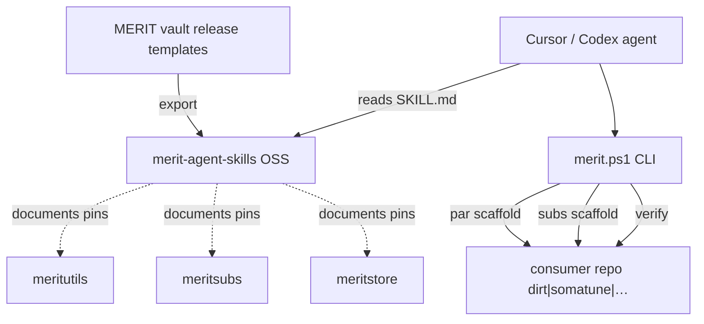

# merit-agent-skills — Low-Level Design Map (LLD_MAP)

**Document ID:** MAS-IAR-LLD-001  
**Repo:** `AgentDraven/merit-agent-skills` (OSS public distribution)  
**Platform PRD:** vault-owned; public repo carries only OSS/export-facing guidance.
**Usage:** [docs/usage.md](../usage.md) · [README.md](../../README.md)

| Field | Value |
|-------|-------|
| **MERIT role** | **Enablement / scaffolding** — not a vault registry runtime provider |
| **Exports from** | MERIT vault release templates at release |
| **Targets** | Any MERIT-shaped consumer repo + OSS adopters |

---

<a id="purpose"></a>
## 1. Purpose & scope ^purpose

LLD map for the **public agent skills layer**: Cursor/Codex skill files, the `merit` CLI, launch config templates, and freemium cfg — wiring agents to meritsubs, meritutils PAR, meritstore, here.now, and Vercel.

---

<a id="ascii-tree"></a>
## 2. ASCII tree ^ascii-tree

```
merit-agent-skills/
├── skills/                      # One folder per skill (SKILL.md)
│   ├── merit-livealpha/
│   ├── merit-par-workbench/
│   ├── merit-portal/
│   ├── merit-subs/
│   ├── merit-ama/
│   ├── merit-admin-gate/
│   ├── merit-deploy-vercel/
│   ├── merit-onboard/
│   ├── meritcert/
│   ├── merit-closeout/
│   └── merit-iar/
├── templates/consumer-static/   # play/ shell scaffolds only
├── cfg/                         # freemium_limits, plus_sku, par_pins templates
├── docs/                        # usage.md TRY_BUNDLES.md
├── docs/IAR/                    # this LLD_MAP
├── scripts/                     # smoke-freemium.ps1
├── merit.ps1 merit.sh
└── LICENSING.md LICENSE
```

---

<a id="skill-rationalization"></a>
## 3. Skill rationalization ^skill-rationalization

| Skill | Invokes / documents | Provider dependency |
|-------|---------------------|---------------------|
| `merit-par-workbench` | PAR scaffold, pin `merit_workbench` | meritutils |
| `merit-subs` | Subscriber production mount scaffold | meritsubs |
| `merit-onboard` | OSS quickstart; operator vocabulary in fallback | MERIT vault, optional |
| `meritcert` | Certification vocabulary; OSS users document status | MERIT vault, optional |
| `merit-closeout` | Public verify + 3-3 closeout vocabulary | MERIT vault, optional |
| `merit-iar` | IAR authoring pattern | MERIT vault, optional |
| `merit-deploy-vercel` | Consumer deploy | Vercel |
| `merit-portal` | here.now portal publish | here.now |
| `merit-admin-gate` | Admin verification flows | consumer-specific |
| `merit-ama` | AMA surface pattern | optional |

---

<a id="interlock"></a>
## 4. Interlock diagram ^interlock


```mermaid
flowchart TB
  SKILLS["merit-agent-skills OSS"]
  LIVE["merit.ps1 CLI"]
  VAULT["MERIT vault release templates"]
  AGENT["Cursor / Codex agent"]
  CONS["consumer repo dirt|somatune|…"]

  VAULT -->|export| SKILLS
  AGENT -->|reads SKILL.md| SKILLS
  AGENT --> LIVE
  LIVE -->|par scaffold| CONS
  LIVE -->|subs scaffold| CONS
  LIVE -->|verify| CONS
  SKILLS -.->|documents pins| meritutils & meritsubs & meritstore
```

---

<a id="api-catalog"></a>
## 5. merit CLI catalog ^api-catalog

```yaml
merit verify --path <repo>:
  summary: Run consumer MERIT foundation checks
  output: pass/fail + checklist IDs
  skill: meritcert/SKILL.md

merit par scaffold:
  summary: Inject PAR pin + adapter stub into consumer
  outputs: cfg par_pins snippet, static adapter template
  provider: meritutils

merit subs scaffold:
  summary: Embed meritsubs mount instructions + env template
  provider: meritsubs

merit deploy:
  summary: Deploy consumer static/portal surfaces
  skill: merit-deploy-vercel/SKILL.md

merit.ps1 skills install:
  summary: Copy skills/ to %USERPROFILE%\.cursor\skills-cursor\ or Agents path
```

---

<a id="config-intent"></a>
## 6. Config templates ^config-intent

| File | Purpose |
|------|---------|
| `cfg/freemium_limits.json` | Showcase tier caps for TRY_BUNDLES |
| `cfg/plus_sku.json` | Plus SKU template → meritstore |
| `cfg/par_pins.json` | Default PAR pin examples |
| `templates/consumer-static/play/` | New repo play-shell bootstrap |

---

<a id="peer-maps"></a>
## 7. Peer maps ^peer-maps

| Peer | LLD_MAP |
|------|---------|
| vault | Operator-only private SSOT; not required for OSS users |
| DIRT | [AgentDraven/dirt](https://github.com/AgentDraven/dirt) |
| meritutils | [MERIT package gateway](https://merit-prod.vercel.app/pkg/meritutils/registry.json) |

---

<a id="document-control"></a>
## 8. Document control ^document-control

| Version | Date | Change |
|---------|------|--------|
| 1.0.0 | 2026-06-16 | Initial MERIT_AGENT_SKILLS_LLD_MAP |
| 1.0.1 | 2026-07-11 | Public-safe peer links and attribution template |
| 1.0.2 | 2026-07-11 | v0.3.11 cleanup: Portal implementation removed from skills repo; merit.ps1 is public command surface |
| 1.0.4 | 2026-07-12 | v0.3.13 launch validation: closeout command and public design doc |
| 1.0.5 | 2026-07-13 | v0.3.14 monotonic patch release: merit-demo Hello World and merit-test clean-clone proof |
| 1.0.3 | 2026-07-12 | v0.3.12 cleanup: shim scripts removed; merit.ps1 is self-contained |

---

<a id="documentation-format-standard"></a>
## 9. Documentation format standard

This is the shared visual and editorial contract for MERIT documentation in both `merit-agent-skills` and `merit-demo`.

### Major sections

- Use one top-level Markdown heading per document.
- Use a colored HTML table band for major sections (`##` level), with a short emoji marker and contrasting bold text.
- Keep the band free of nested heading tags; this avoids GitHub's unwanted inner underline.
- Use the blue band for the primary start/overview section, purple for public/private boundaries, and teal for other major sections.
- Preserve explicit `<a id="...">` anchors before bands when a section is linked from a table of contents.

### Content hierarchy

- Use `###` headings for task/persona subsections; do not add decorative horizontal rules beneath them.
- Use blockquotes for tips, warnings, and “read left to right” instructions.
- Use tables for matrices, command comparisons, and three-step flows.
- Use fenced code blocks for commands and inline code for paths, files, and flags.
- Keep beginner actions in `merit.ps1` / `Merit-Hub.ps1`; raw Git or retired installer commands belong only in historical notes.

### Accessibility and maintenance

- Emoji are cues, not the only meaning; headings must remain understandable without them.
- Keep links descriptive and relative where possible.
- Avoid custom CSS, image-only headings, and deeply nested Mermaid diagrams for core navigation.
- Apply this standard to README, usage, design, deployment, dinner, and IAR documents in both repositories.

### README change record

The README styling work added: a persona matrix, a first-class hello-world path, colored major-section bands, removal of duplicate thick separators, enlarged band text, callout guidance, and command-first beginner instructions.
