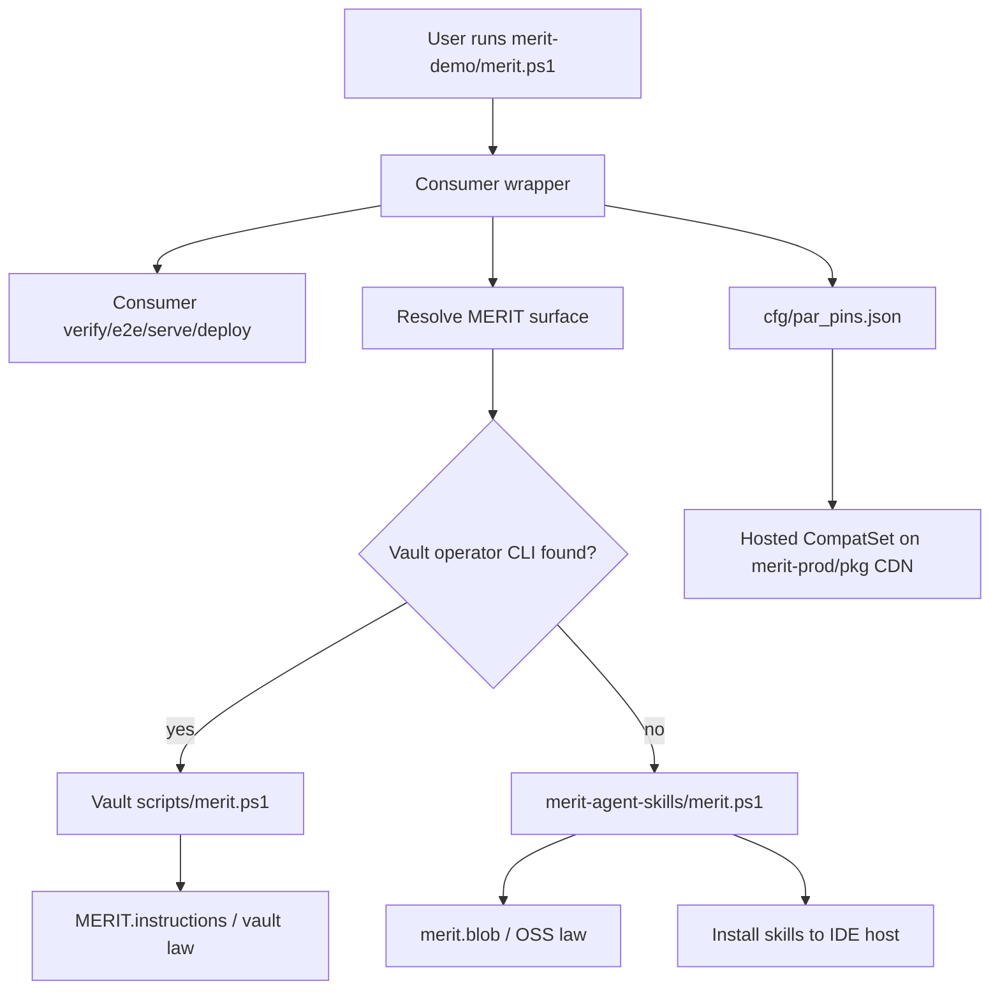
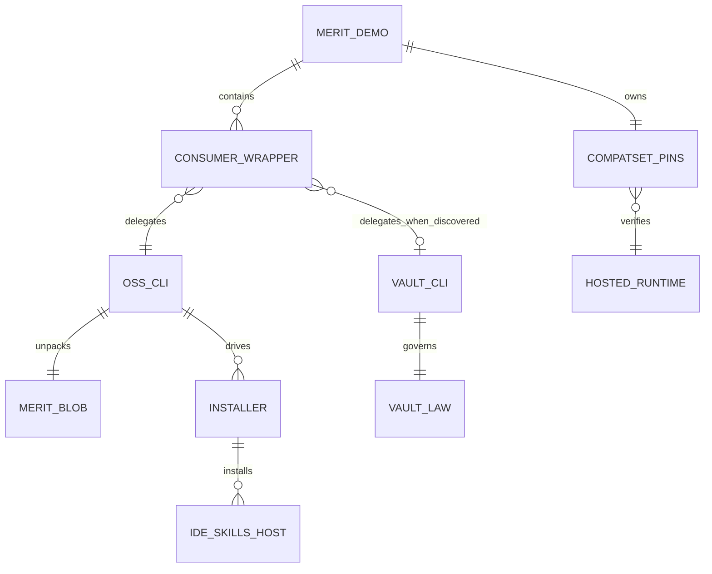

# MERIT Dependency Hierarchy and Delegation IAR

**Status:** Audit complete; corrective action required for consumer delegation and generated-version hygiene  
**Date:** 2026-09-06  
**Scope:** `merit-demo`, `merit-agent-skills`, Hub/install, `merit.blob`, and optional `merit-private-vault`

## Executive finding

The repositories are not duplicate implementations in the strict sense, but the boundary is too implicit. `merit-demo/merit.ps1` is a consumer wrapper and forwards administrative, surface, and release operations to the sibling OSS CLI. It also contains consumer-specific verify/e2e/serve/deploy behavior, which is appropriate. It must not become another copy of the platform CLI.

The OSS CLI is the public plane-B implementation. When a vault is discovered, the law already identifies the vault operator CLI as preferred for operator closeout (`mXin`), but the consumer wrapper does not yet resolve and delegate release operations to that vault CLI. This is the main hierarchy gap.

`merit.blob` is correctly owned by `merit-agent-skills`: `merit.ps1 law` unpacks it in memory. Installers copy skills and emit surface/closeout metadata; they do not replace the law source. The vault may supersede OSS law for operator workflows, but OSS remains the fallback when no vault exists.

## Authority and responsibility matrix

| Plane | Authority | Owns | Must not own |
|---|---|---|---|
| A — IDE host | installed skills under host skills directory | agent guidance, optional hooks, receipts | product runtime or independent law |
| B — `merit-agent-skills` | public OSS `merit.ps1`, `merit.blob`, installers, Hub | public CLI, OSS law excerpt, skill distribution, consumer delegation target | private operator policy |
| C — `merit-private-vault` | vault `scripts/merit.ps1`, `MERIT.instructions` | protected operator law, mXin/mXout, cert/deploy/operator release | public consumer onboarding |
| D — `merit-demo` | consumer-owned wrapper and `cfg/par_pins.json` | demo UX, CompatSet pins, local verify/e2e/serve, consumer docs | copied OSS law, copied vault CLI, independent release semantics |

## Current delegation audit

| Check | Result | Evidence | Finding |
|---|---|---|---|
| Consumer admin/where/surface forwarding | PASS | `merit-demo/merit.ps1:Invoke-MeritSkillsForward` | Delegates to sibling or `MYMERITAPP/oss-bench.json` skills path |
| Consumer closeout delegation | PARTIAL | wrapper forwards `release --path` | Uses OSS release alias directly; does not first select vault operator CLI |
| OSS law source | PASS | `BootStrap/_law.ps1`, `merit.blob` | In-memory law unpacking is centralized in B |
| Vault discovery | PASS | `BootStrap/_resolve.ps1`, `operatorMeritCli` | B can discover C and prints operator preference |
| Consumer vault preference | OPEN | no vault branch in consumer `Invoke-Closeout` | Must be added or explicitly documented as operator-only handoff |
| OSS CLI version display | FIXED | `merit.ps1` now reads `VERSION` | Removed hard-coded stale `0.5.66` |
| CompatSet ownership | PASS | `merit-demo/cfg/par_pins.json` | Runtime package versions/SRI remain consumer-owned pins |
| Install law ownership | PASS | `install.ps1`, `install.sh` | Installs skills; does not vendor `merit.blob` into consumer |
| Hub skills pin | VERIFY | `Merit-Hub/Merit-Hub.ps1`, `oss-bench.json` | Hub has embedded/persisted pin logic; must be checked against current skills release |

## Required hierarchy rule

Resolution order for any release/operator operation must be:

1. If a valid vault operator CLI is discovered, use the vault command and vault law.
2. Otherwise use the public OSS `merit-agent-skills/merit.ps1` and OSS `merit.blob`.
3. The consumer wrapper may add consumer verification before delegation, but must not implement a second release engine.
4. `merit-demo/cfg/par_pins.json` controls hosted CompatSet compatibility; it is not a skills version pin.

## Flow chart

## Ownership / dependency graph

## Version model

- `merit-agent-skills/VERSION` is the official OSS CLI/skills release version. The CLI reads it dynamically; it is not duplicated as a hard-coded constant.
- `skills-vX.Y.Z` is the OSS distribution tag.
- `merit-demo/VERSION` is the consumer release version.
- `cfg/par_pins.json` is the hosted CompatSet baseline: package version, artifact URL, and SRI. It is intentionally independent from the skills release tag.
- Vault versions/tags are private operator releases and must not be substituted into public consumer pins.

## Install and law model

`install.ps1` / `install.sh` copy selected skill cards and write installation metadata to the selected host. They do not copy the full OSS CLI into the consumer and do not make a host the law authority. `Merit-Hub` seeds B, installs skills into A, and records surface paths. `merit.blob` remains in B and is read only by B's law router.

## Corrective actions

| ID | Priority | Action | Owner |
|---|---:|---|---|
| DH-001 | P0 | Make consumer release delegation resolve `operatorMeritCli` first; otherwise delegate to the OSS CLI. | B/C |
| DH-002 | P0 | Keep consumer wrapper limited to consumer UX and preflight; remove any future copied platform commands. | C |
| DH-003 | P0 | Keep CLI version dynamic from `VERSION` and add a test preventing stale hard-coded versions. | B |
| DH-004 | P1 | Add a Hub pin/version consistency check against the fetched skills `VERSION`. | B/H |
| DH-005 | P1 | Add `where --json` evidence showing selected authority: vault or OSS, CLI path, law source, and versions. | B |
| DH-006 | P1 | Add consumer IAR link to this hierarchy report and document that CompatSet pins are separate from skills versions. | C |

## Acceptance checklist

- [x] Consumer admin/where/surface commands delegate to the resolved OSS CLI.
- [x] OSS law is centralized in `merit.blob` and unpacked in memory.
- [x] CLI version reads `VERSION` dynamically.
- [ ] Consumer release selects vault CLI when vault exists.
- [ ] Hub pin/version consistency is checked and recorded.
- [ ] `where --json` reports selected authority and law source.
- [ ] Consumer IAR links here without copying this matrix.

## 3-3

**Done:** Audited consumer, OSS, Hub/install, law blob, and vault boundaries; documented the hierarchy and corrected the stale hard-coded OSS CLI version.

**State:** OSS is the public authority; vault is the intended operator authority when discovered. Consumer release-to-vault delegation remains open.

**Next:** Implement DH-001, DH-004, and DH-005, then run the hierarchy acceptance checklist and release through plain `merit.ps1 closeout`.
