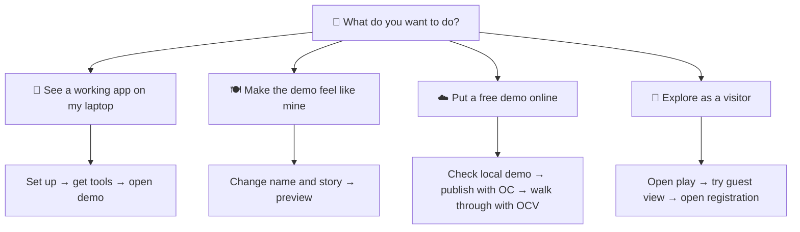

# Try MERIT your way 🧭

You do not need to learn special labels or a list of commands before you can try MERIT. Pick the result you want. The Hub does the setup work; this page explains what you will see and what to try next.

## Choose your next adventure

| If you want to… | Choose this path | You will finish with… |
|---|---|---|
| See a real app working | [Try it on this laptop](#-see-a-working-demo-on-my-laptop) | A local `/play/` page with **Hosted Ready** |
| Make the example yours | [Build over dinner](#-make-the-demo-feel-like-mine) | Your own name, story, and preview |
| Share a free cloud showcase | [Publish OSS in Cloud](#-put-a-free-demo-online) | Hosted play, registration, and marketing links |
| Understand the visitor journey | [Explore as a visitor](#-explore-as-a-visitor) | A clear guest → registration walkthrough |

## 🧪 See a working demo on my laptop

1. **Start — let the Hub prepare the laptop.**
   - Download and run [Merit-Hub.ps1](../Merit-Hub/Merit-Hub.ps1) from a tools folder.
   - Choose **Set up this laptop (1)** if this is a new device or paths need repair.
   - Choose **Get the free MERIT tools (2)**; the Hub selects the tested-together release for you.
2. **Make progress — open the example app.**
   - Choose **Try it (3)**; the Hub downloads or refreshes `merit-demo` safely.
   - It starts or reuses the local web address and opens `/play/` in your browser.
   - Look for **Hello, meritutils**, **Hosted Ready**, and the interactive workbench.
3. **Finish — check what a visitor would experience.**
   - Choose **Validate my local demo (3V)** whenever you want a guided check.
   - Try the guest controls and the **Register free** link.
   - Keep the receipt if you want to compare a later run; you can repeat this path any time.

## 🍽️ Make the demo feel like mine

1. **Start — choose a friendly promise.**
   - Follow the [Build Your App Over Dinner walkthrough](howto/launch-over-dinner.md).
   - Pick a product name and a short welcome message for the people you want to help.
   - Stay local for now; no cloud account is needed for this first creative pass.
2. **Make progress — change words before plumbing.**
   - Update the branding and portal text using the walkthrough’s small, safe edits.
   - Open the local `/play/` page after each change so you see the result right away.
   - Use your AI editor helpers only if you want them; they are optional.
3. **Finish — decide whether it is ready to share.**
   - Run the local validation again with **3V**.
   - Save a screenshot or receipt showing the page you want visitors to see.
   - Move to the cloud path only when the local story and links feel right.

## ☁️ Put a free demo online

1. **Start — prove the local version first.**
   - Complete **Try it (3)** and **Validate my local demo (3V)** first.
   - Confirm the play page opens, the workbench is ready, and the local links behave as expected.
   - Keep your product name handy; the Hub asks for it when it creates the cloud showcase.
2. **Make progress — let the Hub publish the showcase.**
   - Choose **OSS in Cloud (OC)** from the Hub.
   - The Hub checks the needed files and the MERIT hosting service before it publishes.
   - It prints three public links: your play page, free registration page, and marketing page.
3. **Finish — visit the three public pages.**
   - Choose **Walk through my hosted demo (OCV)** under **OC**.
   - Open each link one at a time and compare it with the short expectation shown by the tutorial.
   - If a check fails, the Hub names the failed gate and lets you fix and rerun it; no laptop hosting key is needed.

## 👀 Explore as a visitor

1. **Start — open a page meant for people, not developers.**
   - Use the local `/play/` link after **Try it (3)**, or a hosted link after **OC**.
   - Read the welcome message and notice the workbench or journal surface.
   - You do not need a GitHub, Vercel, or here.now account to look around.
2. **Make progress — try the visitor choices.**
   - Use guest controls and navigation just as a first-time visitor would.
   - Select **Register free** to see the MERIT-hosted registration route.
   - Open the marketing page to see the creator’s plain-language promise.
3. **Finish — record what you learned.**
   - Note which page, message, or call-to-action you would change for your own audience.
   - Return to the dinner walkthrough to make that change locally.
   - Run **3V** or **OCV** again whenever you want the guided checklist.

## A few words you may see

- **Hub** means the friendly menu that prepares your laptop and opens the demo.
- **OC** means **OSS in Cloud**: a free MERIT-hosted showcase, not your own paid cloud account.
- **OCV** means the guided hosted walkthrough after OC succeeds.
- **`merit.ps1`** is the helper command inside the downloaded tools. The Hub tells you when a command is useful; you do not need to use Git commands for the normal first-time path.

For a fuller account and hosting explanation, read [Use MERIT in plain English](usage.md).
