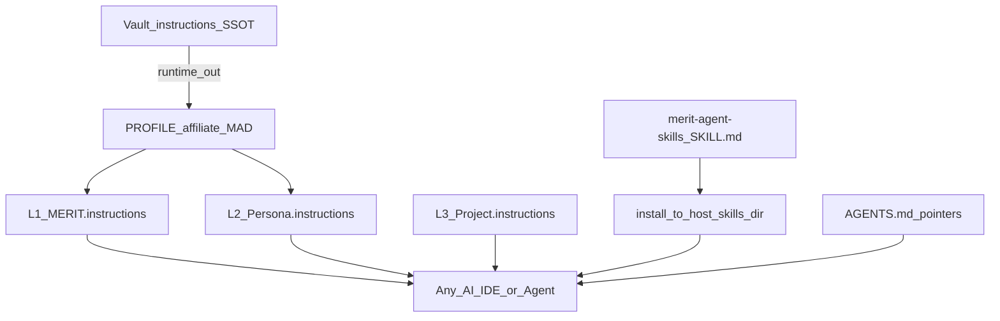

# BootStrap — design & introduction (OSS)

## Purpose

Separate **device BootStrap** from the public **MERIT CLI** (`merit.ps1`) so builders get a one-command laptop setup without confusing it with `init` / `apply` / `verify`.

## Layout

| Location | Role |
|----------|------|
| `BootStrap/MERIT_BootStrap.ps1` (+ `.cmd` / `.sh`) | OSS BootStrap menu |
| `BootStrap/MERIT.json` | Local status template (no secrets) |
| `BootStrap/README.md` | Operator-facing how to run |
| `docs/bootstrap_pathway.md` | Annotated OSS → Private handoff flowchart |
| `cfg/agent_hosts.json` | AI IDE / agent host registry (install paths + auto-detect hints) |
| `%MYMERITAPP%` (default `C:\MyMeritApp`) | Live OSS bench after first run |

## MYMERITAPP

Bench root is not hard-coded forever. First run (or menu **M**) prompts for a path and sets User environment variable **`MYMERITAPP`**. Scripts read process env, then User env, then default `C:\MyMeritApp`.

## Private-Vault teaser (no IP leak)

Menu **T** / **P** may mention only:

1. AgentDraven hosts the private ecosystem account  
2. Private repo `merit-private-vault` exists  
3. That repo contains `BootStrap` to install into `~/dev`  

Clone still requires GitHub permission. Vault product law stays out of this public repo.

## How this branch was landed (one-time)

On 2026-08-20 the work was preserved from a detached `skills-v0.3.53` checkout under `C:\MyMeritApp\merit-agent-skills`:

1. Backup `BootStrap/` + `README.md` to a temp folder  
2. `git fetch origin`  
3. `git checkout -B bootstrap/oss-bootstrap origin/main`  
4. Restore/ensure `BootStrap/` and README Start-here row  
5. Add `docs/design.md` BootStrap section + this file + CHANGELOG entry  
6. Commit and `git push -u origin bootstrap/oss-bootstrap`  
7. Merge to `main`, then baseline release **`skills-v0.3.55`** (menus 1–4 restored; pin docs + tag)

## Cold start (baseline)

```powershell
mkdir C:\MyMeritApp
cd C:\MyMeritApp
git clone --branch skills-v0.3.56 https://github.com/AgentDraven/merit-agent-skills.git
cd merit-agent-skills\BootStrap
.\MERIT_BootStrap.cmd
# Menu T = vault teaser; Menu P = clone AgentDraven/merit-private-vault @ v1.8.71 (GCM credentials)
```

`git clone` must run **from** the bench folder so the repo lands at `%MYMERITAPP%\merit-agent-skills`.

Annotated pathway: [bootstrap_pathway.md](bootstrap_pathway.md).

## Instruction chain (L1 / L2 / L3) — why MERIT stays host-agnostic

MERIT keeps **product law and persona policy inside the ecosystem**, not inside any one vendor’s prompt UI. AI IDEs and agent tools only **mount** skills or read thin pointers (`AGENTS.md`, installed `SKILL.md` trees). They do **not** own or fork L1.

| Tier | What it is | Where it lives (operators) | Public OSS builders |
|------|------------|----------------------------|---------------------|
| **L1** | Platform policy — `MERIT.instructions` | Vault `instructions/MERIT.instructions` → `runtime out` → `%USERPROFILE%\{affiliate}\MERIT.instructions` (**MAD** default) | **Pointer stubs only** in `{Name} docs/MERIT.instructions` — never a full fork |
| **L2** | Persona / Chief-of-Staff layer (e.g. `AgentDraven.instructions`) | Vault `instructions/<Persona>.instructions` → same affiliate runtime | Not published; OSS uses skills + usage docs |
| **L3** | Optional project specialization | `{Project}.instructions` at **consumer repo root** (e.g. `DIRT.instructions`) | Allowed when scoped; must not contradict L1 |

**Read order (every agent, every repo):** L1 → L2 → L3 (if present) → repo `{Name} docs/` product SSOT. **When in doubt, L1 wins.**



**Why this supports Cursor, Codex, Claude Code, Hermes, Paperclip, OpenClaw, Grok Bot, Devin, and future hosts:** policy stays in L1/L2/L3 + public skills. A new host only needs a **skills install path** (or AGENTS.md-compatible entry). You do **not** rewrite MERIT law per vendor.

## AI IDE / agent host registry (`cfg/agent_hosts.json`)

**File:** [`cfg/agent_hosts.json`](../cfg/agent_hosts.json) (schemaVersion 1).

| Field | Purpose |
|-------|---------|
| `hosts[].id` | Stable id used by `install.ps1 -Target` / BootStrap |
| `status` | `supported` (wired today) · `planned` (docs + path known) · `research` (named, path TBD) |
| `destSkills` | Where `skills/` folders are copied |
| `detectHints` | `dir` / `env` / `cmd` probes for **auto-detect** |
| `aliases` | e.g. `Claude` → `ClaudeCode`, `Agents` → `VSCode` |
| `installHint` | CLI one-liner when not yet in `install.ps1` |

**Supported today (`install.ps1`):** Cursor, ClaudeCode, Codex, VSCode/Agents, Project.  
**Planned:** Hermes, OpenClaw.  
**Research (add paths before promoting):** Paperclip, GrokBot, Devin — plus any future host (same JSON row pattern).

### Auto-detect (design — implement after review)

1. Load `cfg/agent_hosts.json`.  
2. For each host with `status` in `supported|planned` and non-empty `detectHints`, evaluate probes.  
3. Present multi-select of **found** hosts (plus always-available manual `-Target`).  
4. Install skills only to selected destinations.  
5. **Adding a future host (e.g. Grok Bot, Devin):** append a `hosts[]` object with `id`, `detectHints`, `destSkills`; set `status` to `planned` then `supported` when `install.ps1` / BootStrap gain the target. No L1 edit required unless policy itself changes.

OSS BootStrap does **not** deploy vault L1. It may later offer “install skills to detected hosts” using this registry only.
