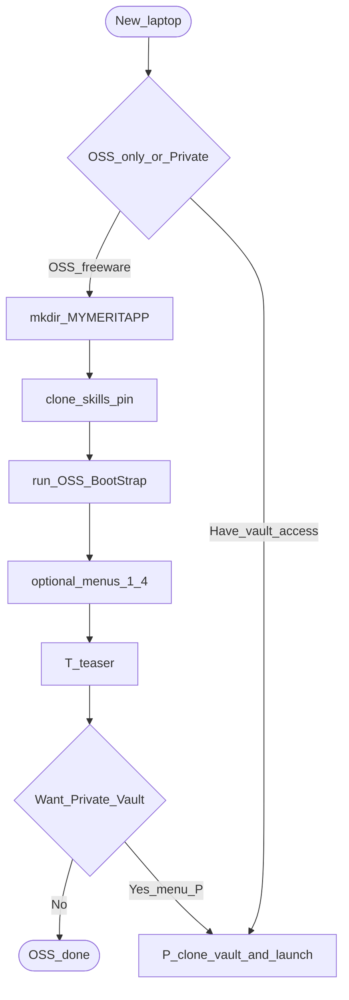

# BootStrap pathway (OSS → Private handoff)

Annotated flowchart for a **new laptop** on the public freeware path. Private-Vault continuation (affiliate **MAD**, persona/repo picker) lives in the vault doc [`vault_usage.md` §7c](https://github.com/AgentDraven/merit-private-vault/blob/main/docs/vault_usage.md#7c-device-bootstrap--affiliate-pathway) (operators only).

**Laptop shared:** `C:\Tools\merit-venv` is installed by **OSS BootStrap menu 1** (same path Private-Vault uses). Affiliate / `runtime out` remain Private-Vault only.

## Cold start

**Easiest path — one file:** [download `Merit-Hub.ps1`](../Merit-Hub/Merit-Hub.ps1) to `C:\Tools\Merit-Hub.ps1`, then **one command**:

```powershell
pwsh -NoProfile -ExecutionPolicy Bypass -File C:\Tools\Merit-Hub.ps1
# J = Jumpstart OSS  |  V = Jumpstart Vault  |  P = Pristine v2
```

Do not run `.\Merit-Hub.ps1` after a browser download (unsigned + Mark of the Web). `Bypass` is this process only.

See [Merit-Hub/README.md](../Merit-Hub/README.md). Release pins are embedded in the script.

**Classic path — clone skills first:**

```powershell
mkdir C:\MyMeritApp
cd C:\MyMeritApp
git clone --branch skills-v0.5.0 https://github.com/AgentDraven/merit-agent-skills.git
cd merit-agent-skills\BootStrap
.\MERIT_BootStrap.cmd
```

Use the current public pin if newer than `skills-v0.5.0` (see repo `VERSION` / tags). Clone **from** the bench folder so the repo lands at `%MYMERITAPP%\merit-agent-skills`.

## OSS pathway flowchart



### What happens at each step

- **New_laptop / OSS_only_or_Private:** Choose public freeware (skills + demo) vs an operator path that needs GitHub access to the private vault. OSS never creates an affiliate runtime.
- **mkdir_MYMERITAPP:** Create the OSS bench root (default `C:\MyMeritApp`). First BootStrap run (or menu **M**) can also set User env `MYMERITAPP`.
- **clone_skills_pin:** Clone this public repo at a release tag (`skills-v*`). Prefer cloning into the bench so paths match BootStrap expectations.
- **run_OSS_BootStrap:** Run `BootStrap\MERIT_BootStrap.cmd`. That installs/refreshes live BootStrap under `%MYMERITAPP%\BootStrap\` and a launcher `%MYMERITAPP%\MERIT_BootStrap.cmd`.
- **optional_menus_1_4:** Prerequisites (**git / gh / `C:\Tools\merit-venv`**), ensure skills under the bench, seed `merit-demo`, closeout/smoke.
- **T_teaser:** Public facts only — AgentDraven hosts the private ecosystem account; repo `merit-private-vault` exists; that repo’s BootStrap installs into `~/dev`. No L1 product law in this public folder.
- **Want_Private_Vault:** Stay on OSS forever, or continue with menu **P**.
- **P_clone_vault_and_launch:** Clones the private vault at the pinned release tag (needs credentials / GCM), then launches **Private-Vault** BootStrap. Continue there with edition **V**.

## What OSS BootStrap does *not* do

| Concern | OSS? | Where instead |
|---------|------|----------------|
| Affiliate id / `%USERPROFILE%\{id}` | No | Vault affiliate wizard → default **MAD** |
| `runtime out` / `runtime verify` | No | Vault `scripts/merit.ps1` after affiliate configured |
| Persona/repo bulk clone into `~/dev` | No | Vault BootStrap picker (after affiliate) |
| Marketing attribution skill | Separate | Public skill `merit-affiliate` (not operator runtime) |
| Full L1 / L2 product law | No | Private vault `instructions/`; OSS uses skills + pointer stubs |

## MERIT Python on the laptop

`C:\Tools\merit-venv` is **not** assumed pre-installed. BootStrap **menu 1** creates it (OSS and vault), like git/gh. Public root `merit.ps1` remains PowerShell-first; Tools Python helps **merit-demo / Flask** and later vault `scripts/merit.ps1`.

## After first clone — use merit.ps1 (not raw git)

Cold start may use `git clone` **once**. After that:

- OSS consumer work: `.\merit.ps1` (`verify` / `closeout` / `init` / …)
- Operator closing this skills repo or the vault: vault `scripts/merit.ps1` → **`mXin`** / **`mXout`** / **`git verify`** / **`runtime out`**

Do not agent-closeout with raw `git commit`/`tag`/`push`. See vault §7c.7.

## Related

- [BootStrap/README.md](../BootStrap/README.md) — how to run
- [docs/bootstrap.design.md](bootstrap.design.md) — design / L1–L3 / agent host registry / merit.ps1 law
- [`cfg/agent_hosts.json`](../cfg/agent_hosts.json) — host install + detectHints
- Root [README.md](../README.md) Start-here — OSS BootStrap row
