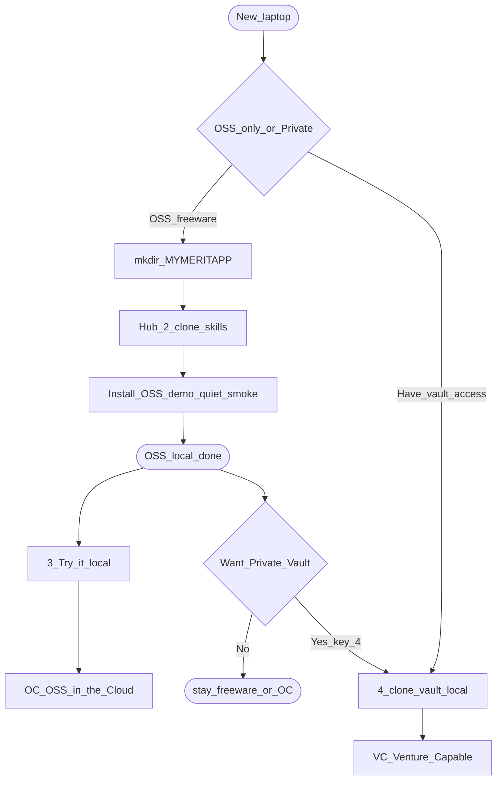

# BootStrap pathway (OSS → Private handoff)

Annotated flowchart for a **new laptop** on the public freeware path. Private-Vault continuation (affiliate **MAD**, persona/repo picker) lives in the vault doc [`vault_usage.md` §7c](https://github.com/AgentDraven/merit-private-vault/blob/main/docs/vault_usage.md#7c-device-bootstrap--affiliate-pathway) (operators only).

**Laptop shared:** `%MYMERITTOOLS%\merit-venv` (default `C:\Tools`) is installed by **OSS BootStrap menu 1** and Merit-Hub prereqs (same path Private-Vault uses). Affiliate / `runtime out` remain Private-Vault only.

## Cold start

```powershell
pwsh -NoProfile -ExecutionPolicy Bypass -File C:\Tools\Merit-Hub.ps1
```

Save Hub via **Raw** first. Menu **2** (alias **J**) clones the current `skills-v*` pin into `%MYMERITAPP%\merit-agent-skills` and continues Install OSS in the same window. Do **not** copy `BootStrap/` to `%MYMERITAPP%\BootStrap\`.

Use the current public pin (see repo `VERSION` / tags). Clone **from** the bench folder only if you are installing skills by hand so the repo lands at `%MYMERITAPP%\merit-agent-skills`.

## OSS pathway flowchart



### What happens at each step

- **New_laptop / OSS_only_or_Private:** Choose public freeware (skills + demo) vs an operator path that needs GitHub access to the private vault. OSS never creates an affiliate runtime.
- **mkdir_MYMERITAPP:** Create the OSS bench root (default `C:\MyMeritApp`). Hub first run (or menu **M**) can also set User env `MYMERITAPP`.
- **Hub_2_clone_skills:** Merit-Hub **2** (alias **J**) clones this public repo at a release tag (`skills-v*`) into the bench. Internals: `_oss.ps1` inside that clone — not a second script.
- **Install_OSS_demo_quiet_smoke:** Seed `merit-demo`, then validate (`closeout` + quiet `smoke`). Local freeware OSS is done here. Old D+G live inside this step.
- **3_Try_it_local:** Open `merit-demo\play\index.html`. Not hosted yet.
- **OC_OSS_in_the_Cloud:** Publish play+cfg + `portal/` as `/play/site` to merit-prod; store activate **must** succeed. here.now is a platform-key upgrade (laptop never sees the key).
- **Multi-creator dogfood (one PC):** Process-only `MYMERITAPP` benches under `C:\MyMeritApps\benches\<name>` sharing one `MYMERITTOOLS`. Wrapper: `Merit-Hub/oc-bench.ps1 -Name creator-01 -All`. Do **not** copy Tools 5×. Subscribers are not benches.
- **Want_Private_Vault:** Stay on OSS/OC, or continue with key **4**.
- **4_clone_vault_local:** Clones the private vault at the pinned release tag (needs credentials / GCM). Still local.
- **VC_Venture_Capable:** Operator/tenant grade vs freeware OC. Vault BootStrap on this laptop.

Do **not** create `%MYMERITAPP%\BootStrap\` or `%MYMERITAPP%\MERIT_BootStrap.cmd`. Those were a retired live copy of the old BootStrap product.

## What OSS BootStrap does *not* do

| Concern | OSS? | Where instead |
|---------|------|----------------|
| Affiliate id / `%USERPROFILE%\{id}` | No | Vault affiliate wizard → default **MAD** |
| `runtime out` / `runtime verify` | No | Vault `scripts/merit.ps1` after affiliate configured |
| Persona/repo bulk clone into `~/dev` | No | Vault BootStrap picker (after affiliate) |
| Marketing attribution skill | Separate | Public skill `merit-affiliate` (not operator runtime) |
| Full L1 / L2 product law | No | Private vault `instructions/`; OSS uses skills + pointer stubs |

## MERIT Python on the laptop

`C:\Tools\merit-venv` is **not** assumed pre-installed. Hub **1** / PHASE 1 prereqs create it (same path Private-Vault uses). Public root `merit.ps1` remains PowerShell-first; Tools Python helps **merit-demo / Flask** and later vault `scripts/merit.ps1`.

## After first clone — use merit.ps1 (not raw git)

Cold start may use `git clone` **once**. After that:

- OSS consumer work: `.\merit.ps1` (`verify` / `closeout` / `init` / …)
- Operator closing this skills repo or the vault: vault `scripts/merit.ps1` → **`mXin`** / **`mXout`** / **`git verify`** / **`runtime out`**

Do not agent-closeout with raw `git commit`/`tag`/`push`. See vault §7c.7.

## Related

- [BootStrap/README.md](../BootStrap/README.md) — how to run
- [docs/bootstrap.design.md](bootstrap.design.md) — design / L1–L3 / agent host registry / merit.ps1 law
- [`cfg/agent_hosts.json`](../cfg/agent_hosts.json) — host install + detectHints
- Root [README.md](../README.md) Start-here — OSS BootStrap row
