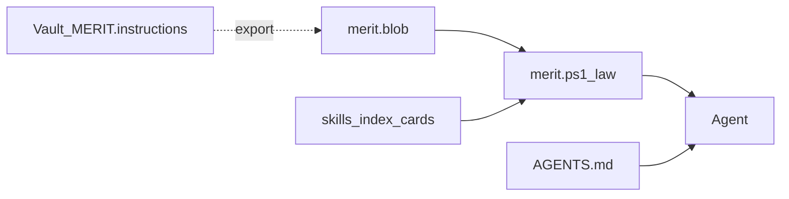

# Merit law pack (merit.blob)

Public OSS distribution of **near-comprehensive L1 excerpt** without shipping plaintext `MERIT.instructions`.

## Files

| File | Role |
|------|------|
| `merit.blob` | Obfuscated gzip + XOR law pack (committed, not human-readable) |
| `cfg/merit_law.json` | Section index + skill→section map (metadata only, no law text) |
| `BootStrap/_law.ps1` | Unpack + query (in-memory only) |
| `scripts/export-merit-law-blob.ps1` | Regenerate blob (operators / release) |

## Agent usage

```powershell
.\merit.ps1 law list
.\merit.ps1 law closeout
.\merit.ps1 law --for-skill merit-portal
.\merit.ps1 law edition
```

## Regenerate (release)

From merit-agent-skills (bootstrap):

```powershell
pwsh -File scripts/export-merit-law-blob.ps1 -SkillsVersion <VERSION>
```

From vault when L1 changes (operator):

```powershell
& <vault>\scripts\merit.ps1 law export-blob -Source instructions/MERIT.instructions -Out <skills-repo>\merit.blob
```

Then bump `VERSION`, `CHANGELOG`, and `ship`.

## IP model

Obfuscation deters casual fork of L1 in the public tree. Agents see law when `merit.ps1 law` prints it. Full L1 SSOT remains in vault.

## Instruction chain (OSS)



L2/L3 are not published in merit-agent-skills. Operators use vault `runtime out`.
